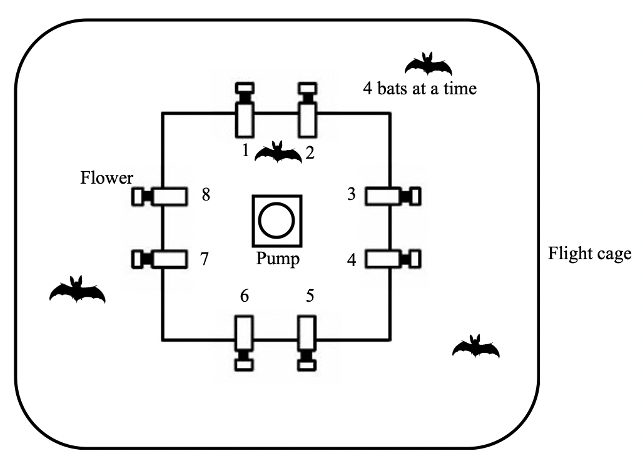

```{css style settings, echo = FALSE}
blockquote {
    margin: 0 0 20px;
    font-size: 14px;
}
```
---

Shambhavi Chidambaram^1,2**\***^, Sabine Wintergerst^3^, Alex Kacelnik^4^, York Winter^1,2^, Vladislav Nachev^1^

^1^ Institute of Biology, Humboldt University, Berlin, Germany

^2^ Berlin School of Mind and Brain, Humboldt University, Berlin, Germany

^3^ Fairchild Tropical Botanic Garden, Miami, USA

^4^ Department of Zoology, University of Oxford

^**\***^**For correspondence:** shambhavi.chidambaram\@hu-berlin.de

**Present Address:** Institute of Biology, Humboldt University, Philippstr. 13, 10115 Berlin, Germany

```{r setup, include=FALSE}
knitr::opts_chunk$set(
  echo = FALSE, 
  message = FALSE, 
  warning = FALSE, 
  fig.align = "center", 
  fig.pos = "H")
```

```{r Reading-in-the-packages}
# clearing the environment
 rm(list = ls())

# installing the required packages if needed and loading them
if (!require(rmarkdown)) {
  install.packages("rmarkdown")
}
if (!require(reshape2)) {
  install.packages("reshape2")
}
if (!require(tufte)) {
  install.packages("tufte")
}
if (!require(rticles)) {
  install.packages("rticles")
}
if (!require(knitr)) {
  install.packages("knitr")
}
if (!require(shiny)) {
  install.packages("shiny")
}
if (!require(flextable)) {
  install.packages("flextable")
}
if (!require(scales)) {
  install.packages("scales")
}
if (!require(tidyverse)) {
  install.packages("tidyverse")
}
if (!require(gluedown)) {
  install.packages("gluedown")
}
if (!require(glue)) {
  install.packages("glue")
}
if (!require(ggthemes)) {
  install.packages("ggthemes")
}
if (!require(lubridate)) {
  install.packages("lubridate")
}
if (!require(ggpubr)) {
  install.packages("ggpubr")
}
if (!require(gridExtra)) {
  install.packages("gridExtra")
}
if (!require(Hmisc)) {
  install.packages("Hmisc")
}
if (!require(brms)) {
  install.packages("brms")
}
if (!require(bayesplot)) {
  install.packages("bayesplot")
}
if (!require(MCMCglmm)) {
  install.packages("MCMCglmm")
}
```

```{r Themes-and-CI-functions}

# creating two themes for all the plots

theme_srl <- function() {
  theme_pubr() +
    theme(
      axis.text = element_text(size = 8, family = "Times"),
      axis.title = element_text(size = 10, family = "Times"),
      strip.text.x = element_text(size = 10, family = "Times"),
      strip.text.y = element_text(size = 10, family = "Times"),
      legend.text = element_text(size = 10, family = "Times"),
      legend.title = element_text(size = 12, face = "bold", family = "Times")
    )
}

theme_srl2 <- function() {
  theme_bw() +
    theme(
      axis.text = element_text(size = 8, family = "Times"),
      axis.title = element_text(size = 10, family = "Times"),
      strip.text.x = element_text(size = 10, family = "Times"),
      strip.text.y = element_text(size = 10, family = "Times"),
      legend.text = element_text(size = 10, family = "Times"),
      legend.title = element_text(size = 12, face = "bold", family = "Times")
    )
}
 # writing a function to automate the reporting of an estimate and error bars
report_m_ci_perc <- function(tbl, par = "_r_", brackets = "round") {
  open_bracket <- case_when(
    brackets == "round" ~ "(",
    brackets == "square" ~ "[",
    brackets == "squiggly" ~ "{",
    brackets == "none" ~ "",
    TRUE ~ str_sub(brackets, 1, 1)
  )
  
  close_bracket <- case_when(
    brackets == "round" ~ ")",
    brackets == "square" ~ "]",
    brackets == "squiggly" ~ "}",
    brackets == "none" ~ "",
    TRUE ~ str_sub(brackets, 2, 2)
  )
  
  tbl <- tbl %>% 
    mutate(CI = paste0(open_bracket, "95% CI ", ymin, ", ", ymax, close_bracket))
  
    return(glue("{tbl$y}% {tbl$CI}"))
}

# writing a function to make a table to get estimates and error bars as a model output

model_outputs <- function(model, fixed_effects) {
  
# creating a table with the required values for the forest plot
t1 <- fixef(model, 
            probs = c(0.055, 0.945)) %>%
  as_tibble() %>%
  mutate(
    `Fixed effect` = fixed_effects,
    Estimate = round(Estimate, digits = 2),
    Q5.5 = round(Q5.5, digits = 2),
    Q94.5 = round(Q94.5, digits = 2)
  ) %>%
  # renaming the credibility intervals column
  mutate("89% Credibility intervals" = paste0("[", Q5.5, ", ", Q94.5, "]")) %>%
  #filter(`Fixed effect` != "Intercept") %>%
  rename(labels = `Fixed effect`) %>%
  select(labels, Estimate, `89% Credibility intervals`) %>%
  mutate(All = paste0(Estimate, " ", `89% Credibility intervals`)) %>%
  select(labels, All)
}

# setting the maximum value on the x axis to locate the labels
max_xvalue_output <- function(model, fixed_effects) {
  
max_xvalue <- fixef(model, 
                    probs = c(0.055, 0.945))%>%
  as_tibble() %>%
  mutate(
    `Fixed effect` = fixed_effects,
    Estimate = round(Estimate, digits = 2),
    Q5.5 = round(Q5.5, digits = 2),
    Q94.5 = round(Q94.5, digits = 2)
  ) %>%
  #filter(`Fixed effect` != "Intercept") %>%
  select(Q94.5) %>%
  filter(Q94.5 == max(Q94.5)) %>%
  as.numeric()

}

```

# Abstract

Flowering plants stay in one place, but the amount of nectar a flower contains varies as it is emptied, replenishes itself, or dies. Nectar-feeding animals must trade off exploring new flowers that are potentially rewarding and exploiting flowers known to be rewarding. Discrimination between the rewarding properties of flowers and flexible responses to changes in those properties are abilities with strong advantages in such a foraging environment. Commissaris’s long-tongued bat is known to have the former; we aimed to explore the latter through a spatial serial reversal learning task. Wild bats were trained to obtain rewards from two artificial flowers. At any given time only one of the flowers provided a reward. After the bats had experienced the rewarding properties of the flowers for some time, a reversal happened: the rewarding flower became non-rewarding and vice versa. These reversals of rewarding properties occurred repeatedly.
We found strong evidence that the bats learn the rule underlying reversing: when a food location suddenly dried up they quickly abandoned visiting it and switched to the alternate option. This shows that they can ‘learn to learn.’ After experiencing multiple such serial reversals, bats switched more rapidly to the rewarding option after a reversal and chose the rewarding flower more frequently overall. In fact, this increase in the number of choices for the rewarding flower became high enough that it could not increase much further: a ceiling effect was seen in the animals’ preferences. In the tradeoff between exploration and exploitation the animals’ behaviour approached a ‘best of both worlds’ strategy. The bats showed near-exclusive preference for the rewarding option, which they rapidly changed to after a reversal as they had learned the rule behind the environmental change and relied on it. The question of whether nectar-feeding bats can understand other predictable but more complex environmental patterns produced by the deterministic process of floral nectar secretion, or even potentially anticipate and predict them, is exciting grounds for further research. 


# Introduction

Nectar-feeding bats face the challenge of exploiting resources that continually change with time, but are relatively predictable in space. Floral nectar content varies within any given night, as well from night to night; flowering plants are stationary, however, they bloom seasonally and single flowers on plants themselves wither and die every day or every few days. Bats need to detect the changing reward contingencies in their environment and adjust their behaviour accordingly. This ability of animals to recognize and respond to changes is crucial for behavioural efficiency and includes cognitive or behavioural flexibility [@tello-ramos_spatial_2019]. One experimental protocol that has been widely used to demonstrate cognitive/behavioural flexibility is reversal learning, a task that is a simple experimental analogue to some of the decision-making bats do in their natural environment.

Reversal learning essentially involves two separate stages of learning. An animal must first learn about multiple stimulus response associations. These can be two spatial locations that potentially provide a food reward. The animal is then confronted with the next step which is a situation where in fact only one of the two options is profitable. In this phase of the experiment, it is optimal to only pay attention to this one option and ignore other possibilities. However, after a longer series of such repetitive stimulus response actions, reinforcement stops. The optimal strategy for the animal is to then immediately abolish its recent behavior and instead perform another stimulus response action that in the past had proven profitable. It is this ability to abruptly terminate an ongoing behavior in favor of switching to another behavior that the animal should learn for efficient exploitation. In a serial reversal learning procedure the reward contingencies reverse repeatedly. An animal that responds to the rewarding stimulus more frequently than to the non-rewarded stimulus receives food more often and performs more efficiently on the task; a choice to the non-rewarded stimulus is, in the context of the task, an ‘error.’ This performance critically depends on the animal ‘s ability to switch abruptly after a reversal.

The serial reversal learning protocol can be adapted to the behaviour and sensory physiology of many different species, thus allowing comparative research. It has been done using visual stimuli in bumblebees [@strang_serial_2014] and guppies [@boussard_brain_2020]; visual and spatial stimuli in both corvids [@bond_serial_2007-1] and cowbirds [@lois-milevicich_sex_2021]; spatial stimuli in rats [@boulougouris_effects_2007], great tits [@hermer_elevation-related_2018] and gray squirrels [@chow_serial_2015]; and olfactory stimuli in rats [@kinoshita_effects_2008]. Reversal learning, specifically serial reversal, has been used as an explicit comparative measure of animal 'intelligence' [@bitterman_evolution_1964]: animals considered then to be 'higher', like pigeons, rats and monkeys showed a progressive improvement on the task while species considered to be 'lower', like turtles and fish, did not. Though the idea of such a hierarchy is outdated, comparative research using reversal learning can reveal important differences in behaviour and learning that have evolved under the selection pressures faced by different species.

Improvement in the reversal learning task is clearly demonstrable and is therefore a meaningful criterion when comparing the performance of different species. First-order learning happens when an animal perceives a stimulus and learns which behavioural response leads to a reward - the stimulus-reward association - and changes its behaviour according to the strength of this reinforcement. Higher-order or second-order learning is the learning of rules or strategies. This is the ability to actually choose efficiently among potential behavioural responses in any given situation. In serial reversal learning the same stimuli are successively paired with a reward and then not paired with a reward. Under such conditions animals must learn the second-order rule to quickly abandon a suddenly unsuccessful response that previously resulted in reward. A rule that can maximize reward in a deterministic, reversal learning schedule is ‘win-stay; lose-shift’: repeat the behaviour which produces a reward until it stops being rewarding, and then immediately switch to another behavioural response. Such a rule means in practice that the animal makes exactly one ‘error’ per reversal. After learning the task, the perfectly optimal animal will first exclusively respond to the rewarded stimulus. After the first experience of a lack of reward (the error), the animal will change its actions and exclusively respond to the other stimulus which is now paired with a reward.

Animals are rarely, if ever, so optimal in real life. Large and deterministic changes are uncommon in nature and more gradual shifts in behaviour maybe better suited to natural environmental changes. Errors in reversal learning tasks are common and can occur in different ways. An animal can perseverate: continue to choose a non-rewarding cue after the reversal has occurred or they can make anticipatory errors: changing their behaviour and choosing the other cue before a reversal has occurred. Progressive ‘improvement’ in this task, where an animal makes fewer and fewer errors per reversal is indication that the animal is learning the rule of reversal, or ‘learning to learn’[@shettleworth_cognition_2010].

Primates show a very interesting difference in between first- and second-order learning. In one study, thirteen different species of primates were compared on a visual reversal learning task [@rumbaugh_toward_1996], where they were trained to discriminate a pair of stimuli up to either a 67% or 84% level of correct choices for the rewarded option. At these two different levels of training they were then given a single reversal of reward contingencies. If the primates' behaviour was driven mainly by first-order learning, they should switch to the newly-rewarding stimulus more quickly when their training had not yet reached a high level of performance, i.e., 67%. The opposite would be true if second-order learning or rule-learning was occurring: knowing the reversal rule, the primates would more quickly adapt to the reversed option when they had reached a high level of performance in their training, i.e., 84%. The results showed that Prosimian species tended to perform better when trained to 67% and apes when trained to 84% level of correct choices before the reversal.

Progressive improvement on the serial reversal task as more reversals are experienced, which is evidence of rule-learning, has been shown in many different species: bumblebees [@strang_serial_2014]; great tits from different environments [@hermer_elevation-related_2018]; three different species of corvids [@bond_serial_2007-1]; rats [@castane_selective_2010]; and marmosets [@clarke_lesions_2008]. A decrease in the number of errors to reach a criterion (a pre-decided number of correct choices) with multiple reversals is seen in mice [@caglayan_learning_2021], even when each reversal is done with a different pair of stimuli, indicating the formation of a learning set.

What performance on the serial reversal task says about the deeper cognitive mechanisms at work, and whether the task is a measure of cognitive or behavioural flexibility, are not completely settled questions. Cognitive flexibility cannot be directly observed; it is inferred to have occurred through changes in behaviour, or behavioural flexibility [@tait_assessment_2018]. However, behavioural flexibility does not necessarily indicate cognitive flexibility [@dhawan_more_2019]. The term 'behavioural flexibility' itself has been used widely but inconsistently, applied to many traits that have different underlying neural mechanisms or do not co-vary [@audet_whats_2017]. Behavioural flexibility in animals has evolved in response to selection pressures from different foraging environments: the flexibility required to deal with seasonal changes in fruit availability is not the same kind of flexibility required to deal with capturing a prey animal intent on escaping.

There is a sense in which the foraging ecology of some nectar-feeding animals is a natural analogue to the serial reversal learning task. The Neotropical bat species *Glossophaga commissarisi* relies primarily on flower nectar for energy. These bats have remarkably high metabolic rates for their body mass [@voigt_energetic_1999; @voigt_field_2006], due to the energetic demands of flight [@winter_energy_1998; @von_helversen_nectar_1984]. Many plants visited by bats put out only a few flowers every night, but their flowering seasons that can last for several months. Bat-pollinated flowers can secrete up to 1-2 mL of nectar a night [@von_helversen_adaptations_1993] but as only small droplets are available each time they are visited [@voigt_field_2006], the bats make several hundred flower visits per night. Indeed, a certain time after a flower is emptied the nectar-levels are replenished, so bats can visit the same flower multiple times. The bats relocate the flowering plant primarily through their excellent spatial memory  in addition to local echo-acoustic cues to find the individual flowers [@thiele_hierarchical_2005; @von_helversen_acoustic_1999]. The longer the bat waits, the more the flower refills but the higher the likelihood that a competitor could exploit the flower first. To make repeated, profitable visits to a flower, a bat must remember both the location of the flower and, ideally, estimate the flower’s expected reward value. The serial reversal learning task requires an animal to respond to a change in the profitability of available options, and remember all potentially rewarding options. Though this is a simplified situation with no inter-individual competition, the behavioural flexibility required by the experimental protocol is the kind of flexibility required in the natural foraging circumstances of a nectar-feeding bat.

To investigate the flexibility of responding to depleting food locations we carried out a serial reversal learning task with wild *G. commissarisi* individuals. The bats were given two potentially rewarding options to choose between. At the start of the night, only one of the options was rewarding, the ‘S+’ option and the other was not rewarding, the ‘S-’ option. After a certain number of visits had been made by the bats, the reward contingencies reversed without any signal or cue to the bats: the previously rewarding option was now unrewarding and the previously unrewarding option was rewarding, and this reversal happened five times in a night.

Our aims with this experiment were as follows. First, we wanted to test how the bats would alter their preference between the two reward sources according to their transient rewarding properties. Second, if the bats demonstrated flexibility in responding to the reversals, we wanted to explore how this was reflected in their decision-making. What would be the relative number of visits made to the rewarding and the non-rewarding options, and how swiftly would behavioural allocation between the two options change after a reversal? Third, we wanted to see if the bats were capable of second-order learning, or ‘learning to learn.’ Could the bats learn the rule behind the change in their environment and converge to the maximal payoff of one error per reversal achievable through win-stay, lose-shift?

After the analyses described above were done and the data and results examined, we performed further analyses to explore the conclusions of our confirmatory analyses. The difference between these results must be clearly noted. We reasoned that there is a difference between the first visits of a night, before any experience of a change in contingencies, and all the subsequent visits after at least one reversal had occurred. We statistically tested for this difference in the bats’ choice behaviour and compared the results of the confirmatory and exploratory analyses.

# Methods

## Study site and subjects

The experiment took place at La Selva Biological Field Station, Province Heredia, Costa Rica. Bats of the species Glossophaga commissarisi were captured from the wild and retained in a flight cage through the experiment. The bats were attracted to a particular location in the forest using chicken-feeders filled with sugar-water (see Reward below) as bait. The feeders had cotton swabs soaked in dimethyl disulphide on them, a chemical attractant produced by many bat-pollinated flowers [@von_helversen_sulphur-containing_2000]. and then caught in mist-nets. The bats were sexed on capture and housed in two outdoor, meshed flight-cages (4 x 6 m) under ambient light conditions. All individuals were weighed and marked with radio frequency identification (RFID) tags placed as collars around their necks. 

16 bats were selected for the main experiment. A group of four bats of the same sex in a flight cage participated in the experiment together. Two groups were run in parallel, one in each flight-cage so the data were collected simultaneously. At the end of the experiment, the RFID collars were removed and the bats were released back into the wild. All the data collection was completely automatized. Two of the bats did not drink a sufficient amount of sugar-water to meet minimum energy requirements and were released before the end of the experiment and not replaced. The data from these two individuals were not analyzed. Thus, 14 bats (seven males and seven females) completed the experiment. Permission for this research was granted by Sistema Nacional de Areas de Conservación (SINAC) at the Ministerio de Ambiente y Energía (MINAE), Costa Rica.

## Experimental Setup

### Reward

The reward received by the bats during the experiment was also their main source of food. The reward was a 17% by weight solution of sugar dissolved in water, hereafter referred to as ‘nectar.’ The sugar consisted of a 1:1:1 mass-mixture of sucrose, fructose and glucose. The nectar was thus similar in composition and concentration to the nectar produced by wild chiropterophilous plants . Every night the bats were also given ad-libitum access to 10 ml of supplemental food: 3.5g of hummingbird food (NektarPlus, Nekton) and 3.5g of milk powder (Nido 1+, Nestle) in 10 mL of water. They were also given a small bowl of locally-sourced bee pollen.

The reward received by the bats during the experiment was also their main source of food. The reward was a 17% by weight solution of sugar dissolved in water, hereafter referred to as ‘nectar.’ The sugar consisted of a 1:1:1 mass-mixture of sucrose, fructose and glucose. The nectar was thus similar in composition and concentration to the nectar produced by wild chiropterophilous plants [@baker_sugar_1998]. Every night groups of four bats in each cage were also given ad-libitum access to 10 ml of supplemental food: 3.5g of hummingbird food (NektarPlus, Nekton) and 3.5g of milk powder (Nido 1+, Nestle) in 10 mL of water. They were also given a small bowl of locally-sourced bee pollen.

### Flower and pump setup

Each flight cage had a square plastic frame in the center (2x2x1.5m). Eight reward-dispensing devices - hereafter referred to as ‘flowers’ - were fixed in a radial pattern on this frame, two on each side of the square (see Figure 1) with a distance of 40 cm between adjacent flowers. At this distance bats can easily discriminate neighbouring flowers [@thiele_hierarchical_2005]. Each flower had the following parts: an RFID reader mounted on a plastic cylinder around the head of the flower; an infra-red photo gate; an electronic pinch valve through which a silicon tube was placed and fixed to the head of the flower.

A stepper-motor pump was placed in the center of the plastic frame in each cage. The pumps contained a 25 mL Hamilton glass syringe (Sigma Aldrich). The step volume of the two pumps differed slightly: the pump in Cage 1 delivered `r round(40/19, digits = 2)` $\mu$L per step of the stepper-motor, and the pump in Cage 2, `r round(40/12, digits = 2)` $\mu$L per step. The glass syringe was connected to the tubing system of the flowers through five pinch valves [@nachev_psychophysics_2012]. The pinch valves controlled the flow of liquid from the pump to the system and from a reservoir of liquid to the pump. The reservoir (500 mL thread bottle, Roth, Germany) was filled with fresh nectar every day and connected to the syringe through the valves.

Every day at around 1000 h the old nectar was emptied from the system. The system was rinsed and filled with plain water until 1500 h, when it was filled again with fresh nectar. Twice a week the system was filled with 70% ethanol for an hour to prevent microbial growth, then repeatedly rinsed with water. 

When a tagged bat approached a flower, the individual RFID number was read. If the bat then poked its nose into the flower and interrupted the light beam, it triggered the release of a reward. The pinch valve opened and the pump moved the correct number of pre-programmed steps to dispense nectar to the head of the flower. The bat could easily hover in front of the flower and lick up the nectar. Only when both events occurred, i.e., the RFID reader identified a bat and the photo gate was triggered, would a reward be given. The flowers and the pump were connected to a Windows PC, which ran the experimental programs and the program used to automatically flush, clean and fill the pump and tubing system (PhenoSoft Control, PhenoSys). 

(ref:Schematic) Schematic of the cage and flower set-up

```{r, Schematic, fig.cap= "(ref:Schematic)"}


```

## Experimental procedure

Each bat was uniquely assigned two adjacent flowers on the same side of the square frame, out of the array of eight. These flowers were programmed to reward to only one of the four bats in the cage. After the system was filled with fresh nectar at approximately 1700 h, the program was left running for data-collection till the next morning. Thus, the bats could begin visiting the flowers to collect a reward whenever they chose, which was at nightfall at approximately 1800 h every night. During the main experiment the bats could make a maximum of 300 visits a night. 

```{r Pump-filltime-events}
#----------------------------------
# Reading in and preparing the data
#----------------------------------
# reading in the pre-processed data to demonstrate the pump fill time
alldata_pumps <- read.csv2("data/processed_data/raw_data_all.csv", sep = ";", header = TRUE)

# creating a vector of the bats to be excluded from the main analysis
bats_incomp <- c("Bat 7", "Bat 19")

# creating a vector with the beta bats
bats_beta <- c("Bat 1", "Bat 2", "Bat 3", "Bat 4")

# creating a vector of the main experimental days
main_days <- c("Day 1", "Day 2", "Day 3")

#--------------------------
# Analysing the pump events
#--------------------------

# calculating the time for each refill event
pump_time <- alldata_pumps %>%
  filter(Day %in% main_days) %>% 
  group_by(Cage) %>%
  arrange(DateTime) %>%
  filter(MsgValue1 == "start pump" | MsgValue1 == "end pump") %>%
  mutate(interval = ifelse(MsgValue1 == "start pump", as.numeric(difftime(lead(DateTime), DateTime, units = "secs")), "non-fill time")) %>%
  select(DateTime, IdLabel, Condition, Cage, MsgValue1, interval) %>%
  arrange(DateTime) %>%
  filter(
    Condition == "SerialReversalCounter",
    interval != "non-fill time",
    interval < 300
  ) %>%
  mutate(interval = as.integer(interval) / 60) %>%
  summarise(
    mean_filltime = round(mean(interval), digits = 1),
    sd_filltime = round(sd(interval), digits = 2)
  )

# counting the number of fill events per night: there is exactly one so the R code is not cited in the main text
pump_fills <- alldata_pumps %>%
  filter(Condition == "SerialReversalCounter") %>%
  arrange(DateTime) %>%
  group_by(Group, Day) %>%
  mutate(hour = hour(DateTime)) %>%
  filter(
    !IdLabel %in% bats_incomp,
    !IdLabel %in% bats_beta,
    Day %in% main_days,
    hour > 18 | hour < 6,
    MsgValue1 == "start pump"
  ) %>%
  summarise(pump_events = n()) %>%
  ungroup() %>%
  summarise(fill_events = mean(pump_events))
```

```{r, Wrongly-unrewarded-visits}
#----------------------------------
# Reading in and preparing the data
#----------------------------------
# loading the prepared CSV file of raw data
rev_learning_all <- read.csv2(file = "data/processed_data/raw_data_bats.csv", sep = ";", header = TRUE)

# creating a vector of the bats to be excluded from the main analysis
bats_incomp <- c("Bat 7", "Bat 19")

# creating a vector with the beta bats
bats_beta <- c("Bat 1", "Bat 2", "Bat 3", "Bat 4")

# creating a vector of the main experimental days
main_days <- c("Day 1", "Day 2", "Day 3")

# preparing a data frame with all the visits, including the proper but unrewarded ones
rev_learning_all <- rev_learning_all %>%
  filter(
    # filtering only the bats
    str_detect(IdLabel, "Bat"), 
    # removing the bats that did not complete the experiment
    !IdLabel %in% bats_incomp,
    !IdLabel %in% bats_beta,
    # taking only the three main experimental days 
    Day %in% main_days,
    # filtering out the main experimental data
    Condition == "SerialReversalCounter", 
  ) %>%
  mutate(
    # marking the difference between the normal visits in a block and the switch points
    MsgValue1 = ifelse(MsgValue1 == "switch", "switch", "block"),
    # making a column to mark the unrewarded proper visits
    reinforce1value = replace_na(reinforce1value, 0),
    reinforce1Account = replace_na(reinforce1Account, 0),
    Unrew = ifelse(reinforce1value != reinforce1Account, 1, 0)
  ) %>%
  rename(Bat = IdLabel) %>%
  #arrange(Group, Day, Bat, DateTime) %>%
  # grouping the data to count the visits, noting the reversals separately
  group_by(Bat, Day) %>%
  mutate(
    # creating a column with the total number of visits made by a bat per day
    count_vis = ifelse(MsgValue1 == "switch", 0, 1),
    count_vis = cumsum(count_vis)
  ) %>%
  # setting the maximum number of visits a night higher than the programmed max to allow for the unrewarded visits
  filter(count_vis <= 350)

#----------------------------------
# Calculating the unrewarded visits
#----------------------------------

# calculating the percentage of the bats' visits are wrongly unrewarded
mean_unrew <- rev_learning_all %>%
  group_by(Bat, Day) %>%
  filter(MsgValue1 != "switch") %>%
  summarise(mean_unrew = mean(Unrew)) %>%
  mutate(mean_unrew = mean_unrew * 100)

overall_mean_unrew <- round(as.numeric(mean(mean_unrew$mean_unrew), digits = 2))
overall_sd_unrew <- round(as.numeric(sd(mean_unrew$mean_unrew)), digits = 2)
```

During the course of the night, when the syringe of the pump had been emptied, the pump re-filled automatically. This event happened only once every night. On the main experimental days this process took `r as.numeric(pump_time[1, 2])` minutes (SD = ±`r as.numeric(pump_time[1 ,3])`) for the horizontal pump, and `r as.numeric(pump_time[2, 2])` minutes (SD = ±`r as.numeric(pump_time[2, 3])`) for the vertical pump.

About `r overall_mean_unrew` % (SD = ±`r overall_sd_unrew`) of all visits made by the bats over all three experimental nights were wrongly unrewarded: the bats did not receive a reward during these visits even when they were made to a flower assigned to them that was rewarding at the time. This happened either during the pump refill times or when the pump was moving to reward a visit made by another bat that happened almost at the same time. Such events did not count towards the total of 300.

## Experimental design

The experiment proceeded through the following stages.

### Training

On the night the naive bats were captured and placed into the flight cages they could receive a reward from any of the flowers whenever they visited them throughout the night. To enable the bats to find the flowers a small cotton pad was placed on the flowers, soaked in dimethyl disulphide. A small drop of honey was applied to the inside of the flowers to encourage the bats to place their heads inside, interrupt the photo gate and trigger a nectar reward. By the end of the night all the bats had found the flowers and learned to trigger rewards.

After the bats had learned to trigger rewards, the next stage of training involved assigning the bats uniquely to two out of the eight flowers in the array. For an individual animal only these two flowers assigned to it would be rewarding from this stage of training until the end of the experiment. This stage was similar to the previous one, except the bats could only trigger a reward at their assigned flowers, and the chemical attractant and honey were not used.

To ensure that the bats were familiar with both flowers assigned to them they went through one final stage of training: forced alternation after each reward between the two assigned flowers for the duration of one night.

### Serial Reversal Learning Task

In the serial reversal learning task the bats had continuous access to two flowers, one that gave a 40 $\mu$L nectar reward and one that remained empty. The location of the rewarding flower was not cued, but through the Alternation phase of training each bat knew the locations of both flowers that were potentially rewarding to it. After a bat had made 50 visits in total to the two flowers (regardless of relative allocation) a reversal occurred: the previously rewarding flower became the non-rewarding flower and *vice versa*. Importantly, only visits to the two flowers assigned to a bat counted towards the visit tally, not visits to any of the other flowers in the flight cage which were always unrewarding to that particular bat. Each set of 50 visits to the assigned two flowers, either at the start of each night or between reversals, was termed a ‘block’. There were six blocks and five reversals per night, unless the bat ceased visiting earlier. This was repeated for three consecutive nights. The same flower started the sequence every night. Consequently, the last flower to be rewarding one night was non-rewarding at the start of the next.

## Data analysis

The raw data collected during this study were the computer logged events of feeder visits recorded in comma-separated value (CSV) files. Each event included the time stamp, animal ID, photo gate interruption duration and the volume of nectar dispensed. The CSV files were read into R, which was used for all statistical analyses and creation of plots.

All the statistical models were fitted in a Bayesian framework using Hamiltonian Monte Carlo in the R package `brms` [@burkner_brms_2017], which is a front-end for `rstan` (Stan Development Team, 2020). The only exception was one model in the Supplementary section, calculating the correlation between behaviour just before and after the reversal, which was fitted using the R package `MCMCglmm` [@hadfield_mcmc_2010]; the details of this model are provided in the Supplementary section. Model comparison was done using leave-one-out cross-validation, implemented in `brms` using the package `loo` [@vehtari_practical_2017].

Except when stated otherwise, all the visits made by the bats to their two assigned flowers - up to 300 -- during a night were included in the analyses (some of the bats did not complete all 300 visits on every night). The bats made some visits and approaches to the flowers that were not assigned to them but they were the minority, and not considered for the analysis (see **Supplementary Material** for details). At the end of each of the first five blocks a reversal occurred and the end of the last block was the end of data-collection for the night. Each block was further divided into five bins of ten visits, in order to examine the bats' behaviour within each block. Generalized linear mixed-models were used for the analyses (see **Supplementary Material** for details of the model fitting). We report here the mean as a measure of central tendency and the 89% quantile-based credible intervals for the parameters. (89% boundaries are the default for reporting credible intervals - [@mcelreath_statistical_2020]). 

We investigated the effect of experimental night and block on the number of perseverative visits, i.e., consecutive visits to the previously-rewarding option just after the occurrence of a reversal; and the effect of experimental night, block and bin on the proportion of visits to the rewarding flower. The proportion of visits to the rewarding flower was calculated as the number of visits to the S+ divided by total number of visits to both the S+ and S-, and we denote this as the Prop~rew~:

$$\mathrm{Prop_{rew}} = \displaystyle \frac{\rm Number \;of\; visits\; to\; the\; S+ }{\rm (Number \;of\; visits\; to\; the\; S+) + (\rm Number \;of\; visits\; to\; the\; S-)}$$

After examining these results, we conducted further post-hoc exploratory analyses. We investigated the effect of night, block, bin, and the first night and first block of the night as separate predictor variables for Prop~rew~: on the first night the animals had had no prior experience of any reversals, and during the first block of every night they had not experienced any reversals on that night.

A few of the results report 95% confidence intervals, as opposed to credible intervals, and these are noted specifically. The confidence intervals were calculated by non-parametric bootstrapping without assuming a normal distribution of the data, using the `Hmisc` package, which is part of the `tidyverse` system of R packages [@wickham_welcome_2019]. 

All statistical analyses and creation of plots were done in R.

## Data availability

All data and analysis code are available online at .....

# Results

## Confirmatory Analyses

### Bats made a very high proportion of their visits to the rewarding option

```{r, Preparing-main-data}
#----------------------------------------
# Preparing data from the main experiment
#----------------------------------------
# The following terms are used in the analysis of the data:
# 1. Day: a single experimental night during which the data were collected
# 2. block: a group of 50 visits between each reversal where the same flower is rewarding
# 3. bin: a smaller group of visits within a block, the size of which can be set in the code below
# 4. visits: each individual flower visit

# setting binsize and breaks for cutting up the data into block and bin
binsize <- 10
breaks <- seq(0, 3000, binsize)

# making a separate data frame without any unrewarded visits and preparing it further with block and bin numbers
rev_learning <- rev_learning_all %>%
  arrange(Bat, DateTime) %>% 
  filter(Unrew == 0) %>%
  select(-Unrew) %>%
  # grouping the data to count the visits, noting the reversals separately
  group_by(Bat, Day) %>%
  mutate(count_vis = 1:n()) %>% 
  mutate(
    # noting whether the bat made a visit to the more or less rewarding flower
    reward_status = ifelse(reinforce1value > 0, 1, 0),
    # creating a column with the total number of visits made by a bat per day
    count_vis = ifelse(MsgValue1 == "switch", 0, 1)) %>% 
  # removing the visits that are numbered as 0
  #filter(count_vis > 0) %>% 
    # taking the cumulative sum of the visit counts
  mutate(count_vis = cumsum(count_vis)) %>%
  # setting the maximum number of visits a night
  filter(count_vis <= 300) %>%
  ungroup() %>%
  # creating a column with the block number, marking the reversals
  mutate(block = ifelse(MsgValue1 == "switch", 1, 0)) %>%
  group_by(Day, Bat) %>%
  mutate(block = cumsum(block)) %>%
  ungroup() %>%
  group_by(Day, Bat, block) %>%
  # creating a column with the number of visits within each block
  mutate(
    block_vis = ifelse(MsgValue1 == "switch", 0, 1),
    block_vis = cumsum(block_vis), 
  # cutting the visits inside each block into bin of the size set earlier
    bin = as.numeric(cut(block_vis, breaks, include.lowest = TRUE)))

#----------------------------------------------------------------------------
# Calculating the proportion of visits to the rewarding option averaged over all the bats
#----------------------------------------------------------------------------
# averaging the bats' choice behaviour over day, block and bin
rev_learning_avg <- rev_learning %>%
  ungroup() %>% 
  group_by(Day, block) %>%
  mutate(n_bats = n_distinct(Bat)) %>%
  group_by(Day, block, n_bats, bin) %>%
  # calculating the 95% confidence intervals
  group_modify(~ mean_cl_boot(.x$reward_status, conf.int = 0.95)) %>%
  ungroup() %>%
  group_by(Day) %>%
  mutate(
    day_bin = 1:n(),
    day_bin_vis = day_bin * binsize,
    reversal = ifelse(block != lead(block), "switch", "block")
  )

# creating a look-up table so the reversals can be marked
rev_main_avg <- rev_learning_avg %>%
  filter(
    reversal == "switch",
    Day %in% main_days
  ) %>%
  select(Day, block, day_bin, day_bin_vis) %>%
  mutate(Day = case_when(
    Day == "Day 1" ~ "Night 1",
    Day == "Day 2" ~ "Night 2",
    Day == "Day 3" ~ "Night 3"
  ), 
  day_bin_vis = day_bin_vis)

# calculating the sample size in each block
bat_labels <- rev_learning_avg %>%
  select(Day, block, n_bats) %>%
  distinct() %>%
  group_by(Day, block) %>%
  mutate(day_bin_vis = ifelse(block == 1, 25, 50)) %>%
  ungroup() %>%
  group_by(Day) %>%
  mutate(day_bin_vis = cumsum(day_bin_vis)) %>%
  filter(Day %in% main_days) %>%
  mutate(Day = case_when(
    Day == "Day 1" ~ "Night 1",
    Day == "Day 2" ~ "Night 2",
    Day == "Day 3" ~ "Night 3"
  ))

rev_learning_block_avg <- rev_learning %>%
  ungroup() %>% 
  group_by(Day, block) %>%
  mutate(n_bats = n_distinct(Bat)) %>%
  group_by(Day, block, n_bats) %>%
  # calculating the 95% confidence intervals
  group_modify(~ mean_cl_boot(.x$reward_status, conf.int = 0.95)) %>%
  ungroup() %>%
  group_by(Day) %>%
  mutate(
    day_bin = 1:n(),
    day_bin_vis = day_bin * binsize,
    reversal = ifelse(block != lead(block), "switch", "block")
  )
  
```

``` {r, S+-some-bins}
#-------------------------------------------------------------
# Calculating values for visits to the S+ for some of the bins
#-------------------------------------------------------------

# calculating and saving the values for the proportion of visits to the rewarding option in some of the bins
day1bin1 <- rev_learning %>%
  ungroup() %>%
  filter(
    Day == "Day 1",
    block == 1,
    bin == 1
  ) %>%
  mutate(reward_status = reward_status * 100) %>%
  group_modify(~ mean_cl_boot(.x$reward_status, conf.int = 0.95)) %>%
  mutate(
    y = round(y, digits = 1),
    ymin = round(ymin, digits = 1),
    ymax = round(ymax, digits = 1)
  )

day1bin2 <- rev_learning %>%
  ungroup() %>%
  filter(
    Day == "Day 1",
    block == 1,
    bin == 2
  ) %>%
  mutate(reward_status = reward_status * 100) %>%
  group_modify(~ mean_cl_boot(.x$reward_status, conf.int = 0.95)) %>%
  mutate(
    y = round(y, digits = 1),
    ymin = round(ymin, digits = 1),
    ymax = round(ymax, digits = 1)
  )

day1bin5 <- rev_learning %>%
  ungroup() %>%
  filter(
    Day == "Day 1",
    block == 1,
    bin == 5
  ) %>%
  mutate(reward_status = reward_status * 100) %>%
  group_modify(~ mean_cl_boot(.x$reward_status, conf.int = 0.95)) %>%
  mutate(
    y = round(y, digits = 1),
    ymin = round(ymin, digits = 1),
    ymax = round(ymax, digits = 1)
  )

day1bin6 <- rev_learning %>%
  ungroup() %>%
  filter(
    Day == "Day 1",
    block == 2,
    bin == 1
  ) %>%
  mutate(reward_status = reward_status * 100) %>%
  group_modify(~ mean_cl_boot(.x$reward_status, conf.int = 0.95)) %>%
  mutate(
    y = round(y, digits = 1),
    ymin = round(ymin, digits = 1),
    ymax = round(ymax, digits = 1)
  )

day1bin10 <- rev_learning %>%
  ungroup() %>%
  filter(
    Day == "Day 1",
    block == 2,
    bin == 5
  ) %>%
  mutate(reward_status = reward_status * 100) %>%
  group_modify(~ mean_cl_boot(.x$reward_status, conf.int = 0.95)) %>%
  mutate(
    y = round(y, digits = 1),
    ymin = round(ymin, digits = 1),
    ymax = round(ymax, digits = 1)
  )

day1last3bins <- rev_learning %>%
  ungroup() %>%
  filter(
    Day == "Day 1",
    block > 1,
    bin > 2
  ) %>%
  mutate(reward_status = reward_status * 100) %>%
  group_modify(~ mean_cl_boot(.x$reward_status, conf.int = 0.95)) %>%
  mutate(
    y = round(y, digits = 1),
    ymin = round(ymin, digits = 1),
    ymax = round(ymax, digits = 1)
  )

day2and3bin1 <- rev_learning %>%
  ungroup() %>%
  filter(
    Day != "Day 1",
    block == 1,
    bin == 1
  ) %>%
  mutate(reward_status = reward_status * 100) %>%
  group_modify(~ mean_cl_boot(.x$reward_status, conf.int = 0.95)) %>%
  mutate(
    y = round(y, digits = 1),
    ymin = round(ymin, digits = 1),
    ymax = round(ymax, digits = 1)
  )

day2and3lastbins <- rev_learning %>%
  ungroup() %>%
  filter(
    Day != "Day 1",
    block > 1,
    bin > 2
  ) %>%
  mutate(reward_status = reward_status * 100) %>%
  group_modify(~ mean_cl_boot(.x$reward_status, conf.int = 0.95)) %>%
  mutate(
    y = round(y, digits = 1),
    ymin = round(ymin, digits = 1),
    ymax = round(ymax, digits = 1)
  )
```

```{r, side-bias}
side_bias_even <- rev_learning %>% 
  ungroup() %>%
  mutate(flower_type = as.numeric(str_extract(unitLabel, "[0-9]+")), 
         flower_type = ifelse(flower_type %% 2 == 0, "Flower 2", "Flower 1")) %>% group_by(Day, block, bin, flower_type) %>% 
  mutate(side_choice = ifelse(flower_type == "Flower 2", 1, 0)) %>% 
  filter(!is.na(flower_type)) %>% 
  ungroup() %>% 
  select(Bat, Day, block, bin, side_choice) %>% 
  group_by(Day, block, bin) %>% 
  group_modify(~ mean_cl_boot(.x$side_choice, conf.int = 0.95)) %>% 
  ungroup() %>%
  group_by(Day) %>%
  mutate(
    day_bin = 1:n(),
    day_bin_vis = day_bin * binsize,
    reversal = ifelse(block != lead(block), "switch", "block")
  )

side_bias_odd <- rev_learning %>% 
  ungroup() %>%
  mutate(flower_type = as.numeric(str_extract(unitLabel, "[0-9]+")), 
         flower_type = ifelse(flower_type %% 2 == 0, "Flower 2", "Flower 1")) %>% group_by(Day, block, bin, flower_type) %>% 
  mutate(side_choice = ifelse(flower_type == "Flower 2", 0, 1)) %>% 
  filter(!is.na(flower_type)) %>% 
  ungroup() %>% 
  select(Bat, Day, block, bin, side_choice) %>% 
  group_by(Day, block, bin) %>% 
  group_modify(~ mean_cl_boot(.x$side_choice, conf.int = 0.95)) %>%
  ungroup() %>%
  group_by(Day) %>%
  mutate(
    day_bin = 1:n(),
    day_bin_vis = day_bin * binsize,
    reversal = ifelse(block != lead(block), "switch", "block")
  )

dontplot <- side_bias_even %>%
  # filtering only the first three main Days of the experiment:
  # one group had the experiment extended a further three Days
  filter(Day %in% main_days) %>%
  # mutate(
  #   Day = case_when(
  #     Day == "Day 1" ~ "Night 1",
  #     Day == "Day 2" ~ "Night 2",
  #     Day == "Day 3" ~ "Night 3"
  #   ),
  #   # firstpoint = as.factor(ifelse(block == 1 & Day == "Night 1", 1, 0)), 
  #   # day_bin_vis = day_bin_vis - 5
  # ) %>%
  ggplot() +
  geom_point(aes(day_bin_vis, y), color = "red") +
  # scale_color_manual(values = c("0" = "black", "1" = "black")) +
  # scale_fill_manual(values = c("0" = "black", "1" = "white")) +
  geom_line(aes(day_bin_vis, y), color = "red") +
  geom_ribbon(aes(day_bin_vis, y, ymin = ymin, ymax = ymax), alpha = 0.3) +
  geom_point(data = side_bias_odd, aes(day_bin_vis, y), color = "blue") +
  # scale_color_manual(values = c("0" = "black", "1" = "black")) +
  # scale_fill_manual(values = c("0" = "black", "1" = "white")) +
  geom_line(data = side_bias_odd, aes(day_bin_vis, y), color = "blue") +
  geom_ribbon(data = side_bias_odd, aes(day_bin_vis, y, ymin = ymin, ymax = ymax), alpha = 0.3) +
  facet_grid(. ~ Day) +
  scale_x_continuous(breaks = seq(50, 300, by = 50)) +
  scale_y_continuous(breaks = seq(0, 1.1, by = 0.25)) +
  geom_vline(aes(xintercept = day_bin_vis), data = rev_main_avg %>% 
               mutate(Day = case_when(
      Day == "Night 1" ~ "Day 1",
      Day == "Night 2" ~ "Day 2",
      Day == "Night 3" ~ "Day 3"
    ), linetype = "dashed")) +
  geom_hline(yintercept = c(0.25, 0.5, 0.75, 1), linetype = "dotted") +
  theme_srl2() +
  # geom_text(
  #   data = bat_labels,
  #   aes(x = day_bin_vis, y = 1.05, label = n_bats, group = n_bats), family = "Times"
  # ) +
  labs(x = "Visits", y = "Visits to the rewarding option") +
  theme(legend.position = "none")


```
The bats made a very high number of visits to the rewarding option, quickly abandoning an option when it stopped being rewarding after a reversal and switching to the other (Figure \@ref(fig:overall-summary)). A consistent pattern emerged over all three nights: a sharp decrease in the proportion of visits to the formerly rewarding option immediately following a reversal, concomitant with a rapid increase in visits to the newly rewarding option. There are two particularly interesting points about this overall pattern: the behaviour during the first bins of each block; and the changes between the first night and the following two nights.

At the start of the first night, in the very first bin of ten visits when the bats did not yet have any information about the available options and had never experienced a reversal, the Prop~rew~ (the proportion of visits to the rewarding option) averaged across individuals was close to chance: `r report_m_ci_perc(day1bin1, par = "y", brackets = "square")`. Within the next ten visits however, Prop~rew~ increased to `r report_m_ci_perc(day1bin2, par = "y", brackets = "square")` and by the last bin of this first block was `r report_m_ci_perc(day1bin5, par = "y", brackets = "square")`. Immediately after the first experience of a reversal, the Prop~rew~ dropped down to `r report_m_ci_perc(day1bin6, par = "y", brackets = "square")` in the first ten visits, but came back up to `r report_m_ci_perc(day1bin10, par = "y", brackets = "square")` by the last bin of this block.

At the very start of the second and third nights, in the first bin of visits before any experience of a reversal on that night, the average Prop~rew~ of all the bats was `r report_m_ci_perc(day2and3bin1, par = "y", brackets = "square")`. This was significantly higher than random choice and higher than the Prop~rew~ in the corresponding bin of the first night. However, the Prop~rew~ on the second and third nights also showed the pattern of a decrease immediately after a reversal and then increase to a high proportion overall - `r report_m_ci_perc(day2and3lastbins, par = "y", brackets = "square")`, comparable to the `r report_m_ci_perc(day1last3bins, par = "y", brackets = "square")` on the first night.

(ref:overall-summary) Visits to the rewarding of two options across the three experimental nights. Data are average proportions for bins of ten visits averaged over all 14 individuals. Data are indicated by white points in the first block on the first night before the bats had experienced any reversals; the bin averages of the other blocks are indicated by black points. Numbers indicate the bats that participated in a block. Shading shows 95% confidence intervals. Dashed lines show reversals  

```{r, overall-summary, fig.cap = "(ref:overall-summary)", fig.width = 9, fig.height = 3}

p1 <- rev_learning_avg %>%
  # filtering only the first three main Days of the experiment:
  # one group had the experiment extended a further three Days
  filter(Day %in% main_days) %>%
  mutate(
    Day = case_when(
      Day == "Day 1" ~ "Night 1",
      Day == "Day 2" ~ "Night 2",
      Day == "Day 3" ~ "Night 3"
    ),
    firstpoint = as.factor(ifelse(block == 1 & Day == "Night 1", 1, 0)), 
    day_bin_vis = day_bin_vis - 5
  ) %>%
  ggplot(aes(day_bin_vis, y)) +
  geom_point(aes(color = firstpoint, fill = firstpoint), shape = 21) +
  scale_color_manual(values = c("0" = "black", "1" = "black")) +
  scale_fill_manual(values = c("0" = "black", "1" = "white")) +
  geom_line() +
  geom_ribbon(aes(ymin = ymin, ymax = ymax), alpha = 0.3) +
  facet_grid(. ~ Day) +
  scale_x_continuous(breaks = seq(50, 300, by = 50)) +
  scale_y_continuous(breaks = seq(0, 1.1, by = 0.25)) +
  geom_vline(aes(xintercept = day_bin_vis), data = rev_main_avg, linetype = "dashed") +
  geom_hline(yintercept = c(0.25, 0.5, 0.75, 1), linetype = "dotted") +
  theme_srl2() +
  geom_text(
    data = bat_labels,
    aes(x = day_bin_vis, y = 1.05, label = n_bats, group = n_bats), family = "Times"
  ) +
  labs(x = "Visits", y = "Visits to the rewarding option") +
  theme(legend.position = "none")

p1.5 <- rev_learning_block_avg %>%
  # filtering only the first three main Days of the experiment:
  # one group had the experiment extended a further three Days
  filter(Day %in% main_days) %>%
  mutate(
    Day = case_when(
      Day == "Day 1" ~ "Night 1",
      Day == "Day 2" ~ "Night 2",
      Day == "Day 3" ~ "Night 3"
    ),
    firstpoint = as.factor(ifelse(block == 1 & Day == "Night 1", 1, 0)), 
    day_bin_vis = day_bin_vis - 5
  ) %>%
  ggplot(aes(block, y)) +
  geom_point(aes(color = firstpoint, fill = firstpoint), shape = 21) +
  scale_color_manual(values = c("0" = "black", "1" = "black")) +
  scale_fill_manual(values = c("0" = "black", "1" = "white")) +
  geom_line() +
  geom_ribbon(aes(ymin = ymin, ymax = ymax), alpha = 0.3) +
  facet_grid(. ~ Day) +
  scale_x_continuous(breaks = seq(1, 6, by = 1)) +
  scale_y_continuous(breaks = seq(0, 1.1, by = 0.25)) +
  #geom_vline(aes(xintercept = c(1, 2), linetype = "dashed")) +
  geom_hline(yintercept = c(0.25, 0.5, 0.75, 1), linetype = "dotted") +
  theme_srl2() +
  geom_text(
    data = bat_labels,
    aes(x = block, y = 1.05, label = n_bats, group = n_bats), family = "Times"
  ) +
  labs(x = "Block", y = "Visits to the rewarding option") +
  theme(legend.position = "none")

p1.5
```

### Bats switch to the rewarding option faster as they experience more reversals

As the bats experienced more reversals, they made their first visit to the rewarding flower faster and faster: immediately after a reversal, the number of visits to the previously-rewarding flower (perseverative visits) decreased as the animals experienced more reversals (Figure \@ref(fig:perseverative-visits)). The results of the statistical analysis (Figure \@ref(fig:pers-forest-plot)) show that both experimental night (1 to 3) and block within a night (1 to 5) had a negative effect on the number of perseverative visits made by the bats, and the effect of the interaction of night and block was positive. Examining the data however, indicates that this change does not seem to occur on the second and third nights. It would appear therefore, that the bats get faster at responding to reversals only the first night until they reach a plateau, which persists over the second and third nights.

(ref:perseverative-visits) Number of perseverative visits made by the bats after each reversal across all three nights. A perseverative visit is a visit to the previously-rewarding option after a reversal and before any visit to the newly-rewarding option. By definition, there were no perseverative visits in the first block of a night. The red lines show individual data and the black lines the group average (N = 14). Reversals were between the two flowers assigned to an individual bat

```{r, perseverative-visits, fig.cap = "(ref:perseverative-visits)", fig.width = 6, fig.height = 3}
#---------------------------------------------------
# Plotting the perseverative visits made by the bats
#---------------------------------------------------

# preparing the perseverative visits
pers_visits <- rev_learning %>%
  select(-c(Group, Cage, Condition, Day, IdRFID, SystemMsg)) %>%
  # removing the event which marked the reversal
  filter(block_vis != 0) %>%
  group_by(Bat, Day, block) %>%
  mutate(first_rew = cumsum(reward_status)) %>%
  filter(
    block > 1,
    first_rew == 1,
    reward_status == 1
  ) %>%
  ungroup() %>%
  group_by(Day, block) %>%
  mutate(mean_vis = mean(block_vis))

p2 <- pers_visits %>%
  filter(Day %in% main_days) %>%
  mutate(
    Day = case_when(
      Day == "Day 1" ~ "Night 1",
      Day == "Day 2" ~ "Night 2",
      Day == "Day 3" ~ "Night 3"
    ),
    block = block - 1
  ) %>%
  ggplot(aes(block)) +
  geom_line(aes(y = block_vis, group = Bat), color = "red", alpha = 0.5) +
  geom_line(aes(y = mean_vis), color = "black") +
  facet_grid(. ~ Day) +
  ylim(0, 18) +
  theme_srl() +
  ylab("Number of perseverative visits") +
  xlab("Reversal number")

p2
```

```{r, Pers-visits-model}
#---------------------------------------------------
# Model fitting and extracting information for plots
#---------------------------------------------------

# fitting a random slopes and random intercept model to the data, examining the effects of day, block and bin on the number of perseverative visits following a reversal; the response variable is taken to follow a negative-binomial distribution, which assumes that each Poisson count variable has its own rate parameter

# m_pers <-
#   brm(data = analysis_pers, family = negbinomial,
#       block_vis ~ Day + block + Day:block + (1 + Day + block| Bat),
#       prior = c(prior(normal(0, 10), class = Intercept),
#                 prior(normal(0, 10), class = b),
#                 prior(cauchy(0, 1), class = sd)),
#       iter = 2000, warmup = 1000, chains = 4, cores = 4, thin = 3,
#       control = list(adapt_delta = 0.999,
#                      max_treedepth = 12),
#       seed = 12)
#
# save(m_pers, file = "m_pers.rda")

load("data/processed_data/m_pers.rda")

# setting the colour scheme
color_scheme_set("darkgray")

fixed_effects = c("Intercept", "Night", "Block", "Night-Block Interaction")

t1_estimates <- model_outputs (m_pers, fixed_effects)

max_xvalue <- max_xvalue_output(m_pers, fixed_effects)
```

(ref:pers-forest-plot) Forest plot of the estimates of the effect of night and block on perseverative visits; a negative value indicates a decrease of perseverative visits with successive nights and blocks. Circles represent the means of the posterior distributions, thick horizontal lines represent 50% credible intervals, and thin horizontal lines 89% credible intervals. The numbers are the means and 89% credible intervals of each effect

```{r, pers-forest-plot, fig.cap = "(ref:pers-forest-plot)", fig.width = 6.5, fig.height = 1.5}

# creating a plot of the slope coefficients
p3 <- mcmc_intervals(m_pers,
  point_size = 1.1,
  pars = vars(2:4),
  prob_outer = 0.89
) +
  xlim(-0.9, max_xvalue + 0.35) +
  geom_vline(xintercept = 0) +
  scale_y_discrete(
    labels = c(
      "b_Day" = "Experimental night",
      "b_block" = "Block",
      "b_Day:block" = "Night - block interaction"
    ),
    limits = c("b_Day:block", "b_block", "b_Day")
  ) +
  geom_text(
    data = t1_estimates,
    aes(x = max_xvalue + 0.07, y = c(3, 2, 1), label = All, fontface = "bold", family = "Times"), size = 3, hjust = 0
  ) +
  theme_srl()

p3
```

### Bats make more visits to the rewarding option overall as they experience more reversals

As the experiment proceeded and the bats experienced more and more reversals, the overall proportion of the animals’ choices for the rewarding flower increased. This was true within each block, within each experimental night, and across nights: as the bats had experienced more reversals on more nights and had made more visits after a reversal had occurred, the proportion of those visits made to the rewarding option increased. Though this increase consistently occurred, the size of the increase became smaller. That is, there was a progressively smaller ‘improvement’ in performance. This was likely due to a ceiling effect, as the proportion of visits to the rewarding option nearly reached 1 (Figure \@ref(fig:overall-summary)). 

The results of the statistical analysis are shown in \@ref(fig:forest-day-block-bin). All three variables, night, block and bin, had a positive effect on the Prop~rew~. The coefficients of the interactions of experimental night and block, block and bin within the block, and experimental night and bin within the block, were small and all negative.

```{r Day-block-bin-model}
#-----------------------------------------------------------------------
# Fitting the model without accounting for the first day and first block
#-----------------------------------------------------------------------

# fitting the model
# m_dayblockbin <-
#   brm(data = analysis_choices, family = binomial,
#       reward_status | trials(1) ~ Day + block + bin +
#         Day:block +
#         block:bin +
#         Day:bin +
#         (1 + Day + block + bin | Bat), # random slopes
#       prior = c(prior(normal(0, 10), class = Intercept),
#                 prior(normal(0, 10), class = b),
#                 prior(cauchy(0, 1), class = sd)),
#       iter = 2000, warmup = 1000, chains = 4, cores = 5, thin = 3,
#       control = list(adapt_delta = 0.9995, max_treedepth = 15),
#       seed = 12)
#
# # save the model
# save(m_dayblockbin, file = "m_dayblockbin.rda")
# here is the model with the results, ready to be loaded.
load(file = "data/processed_data/m_dayblockbin.rda")

# setting the colour scheme
color_scheme_set("darkgray")

fixed_effects <- c("Intercept", "Night", "Block", "Bin", "Night-Block interaction", "Block-Bin interaction", "Night-Bin interaction")

t2_estimates <- model_outputs(m_dayblockbin, fixed_effects)

max_xvalue <- max_xvalue_output(m_dayblockbin, fixed_effects)
```

(ref:forest-day-block-bin) Forest plot of the estimates of the effect of night, block and bin on the proportion of visits to the rewarding option; a positive effect indicates the visits to the rewarding option increased with successive nights, blocks and bins (within each block). Circles show the means of the posterior distributions, thick horizontal lines the 50% credible intervals and thin horizontal lines the 89% credible intervals. Numbers are slope estimates with 89% credible intervals

```{r, forest-day-block-bin, fig.cap = "(ref:forest-day-block-bin)", fig.width = 7, fig.height = 3}
# creating the plot of slope coefficients
p4 <- mcmc_intervals(m_dayblockbin,
  pars = vars(2:7),
  prob_outer = 0.89,
  point_size = 1.1
) +
  xlim(-0.3, max_xvalue + 0.6) +
  geom_vline(xintercept = 0) +
  scale_y_discrete(
    labels = c(
      "b_Day" = "Experimental night",
      "b_block" = "Block",
      "b_bin" = "Bin",
      "b_Day:block" = "Night - block interaction",
      "b_block:bin" = "Block - bin interaction",
      "b_Day:bin" = "Night - bin interaction"
    ),
    limits = c("b_Day:bin", "b_block:bin", "b_Day:block", "b_bin", "b_block", "b_Day")
  ) +
  geom_text(
    data = t2_estimates,
    aes(x = max_xvalue + 0.03, y = c(6, 5, 4, 3, 2, 1), label = All, fontface = "bold", family = "Times"), size = 3, hjust = 0
  ) +
  theme_srl()

p4
```

## Exploratory analysis

### The effect of the first experimental night and the first block of each night

The first block of an experimental night was qualitatively different from the other blocks, as this was the only part of the night when the bats had not yet experienced a reversal. A similar argument can be made about the very first experimental night: before this night the bats had never experienced a reversal at all. Therefore, we performed an exploratory analysis to specifically explore the effects of the first block of a night and the first night, expanding on our previously-described confirmatory analysis.

In addition to the effect of experimental night, block and bin captured by the model described earlier, the exploratory analysis showed that the bats made more visits to the rewarding flower in the first block of every night (before they experienced any reversals that night), but *not* in the first night overall. However, the highest number of visits to the rewarding flower (the highest Prop~rew~) was in the first block of 50 visits of the very first night, before any reversals had ever been experienced even once. Interestingly, this was despite the Prop~rew~ in the first ten visits of this block being close to random chance (Figure \@ref(fig:overall-summary)).

The analysis showed that the main effects of night, block and bin, and their interactions were similar to the previous model (Figure \@ref(fig:forest-plot-first-night-first-block)). The variable 'block type' (i.e., whether a block was the first block of the night or not), had a large positive coefficient, but 'night type' (whether a night was the first experimental night or not) did not. Block type and night type had an interaction effect with a positive coefficient, showing the effect of the very first block of the whole experiment.

```{r Day-block-bin-first-day-first-block-model}
#---------------------------------------------------------------
# Fitting the model accounting for the first day and first block
#---------------------------------------------------------------

# m_firstday_firstblock <-
#   brm(data = analysis_choices2, family = binomial,
#       reward_status | trials(1) ~
#         Day + block +
#         day_type + block_type + bin +
#         Day:block + block:bin + Day:bin +
#         day_type:block_type + block_type:bin + day_type:bin +
#         (1 + Day + block + day_type + block_type + bin | Bat), # random slopes
#       prior = c(prior(normal(0, 10), class = Intercept),
#                 prior(normal(0, 10), class = b),
#                 prior(cauchy(0, 1), class = sd)),
#       # longer chains were needed for this more complex model to converge
#       iter = 2500, warmup = 1200, chains = 4, cores = 5, thin = 3,
#       control = list(adapt_delta = 0.9995, max_treedepth = 15),
#       seed = 12)

# save the model
# save(m_firstday_firstblock, file = "m_firstday_firstblock.rda")
# loading the completed model 
load(file = "data/processed_data/m_firstday_firstblock.rda")

# setting the colour scheme
color_scheme_set("darkgray")

fixed_effects <- c("Intercept", "Night", "Block", "Night Type 1", "Block Type 1", "Bin", "Night-Block interaction", "Block-Bin interaction", "Night-Bin interaction", "Night Type 1-Block Type 1 interaction", "Block Type 1-Bin interaction", "Night Type 1-Bin interaction")

t3_estimates <- model_outputs(m_firstday_firstblock, fixed_effects)

max_xvalue <- max_xvalue_output(m_firstday_firstblock, fixed_effects)
```

(ref:forest-plot-first-night-first-block) Forest plot of the estimates of the effect of night, block, and bin; and the differential effect of the first night and the first block ('night-type' and 'block-type') on the proportion of visits to the rewarding option; a positive effect indicates the visits to the rewarding option increased with successive nights, blocks and bins (within each block), or there were more visits to the rewarding option on the 'block-type' or 'night-type' indicated. Circles represent the means of the posterior distributions, the thick horizontal lines represent the 50% credible intervals and the thin horizontal lines 89% credible intervals

```{r, forest-plot-first-night-first-block, fig.cap = "(ref:forest-plot-first-night-first-block)", fig.width = 7, fig.height = 5.5}

# creating the plot of slope coefficients
p7 <- mcmc_intervals(m_firstday_firstblock,
  pars = vars(2:12),
  prob_outer = 0.89,
  point_size = 1.1
) +
  xlim(-1, max_xvalue + 0.85) +
  geom_vline(xintercept = 0) +
  scale_y_discrete(
    labels = c(
      "b_Day" = "Experimental night",
      "b_block" = "Block",
      "b_day_type1" = "First experimental night",
      "b_block_type1" = "First block of a night",
      "b_bin" = "Bin",
      "b_Day:block" = "Night - block interaction",
      "b_block:bin" = "Block - bin interaction",
      "b_Day:bin" = "Day - bin interaction",
      "b_day_type1:block_type1" = "First night - first block interaction",
      "b_block_type1:bin" = "First block - bin interaction",
      "b_day_type1:bin" = "First night - bin interaction"
    ),
    limits = c(
      "b_day_type1:bin", "b_block_type1:bin", "b_day_type1:block_type1", "b_Day:bin",
      "b_block:bin", "b_Day:block", "b_bin", "b_block_type1", "b_day_type1",
      "b_block", "b_Day"
    )
  ) +
  geom_text(
    data = t3_estimates,
    aes(x = max_xvalue, y = c(11:1), label = All, fontface = "bold", family = "Times"), size = 3, hjust = 0
  ) +
  theme_srl()

p7
```

We compared the predictive accuracy of the model that included night type and block type to the model that did not include these, using leave-one-out cross-validation (LOO). The LOO criterion was lower for the former than the latter, indicating better predictive accuracy of the model including night-type and block-type (Table \@ref(tab:Model-comparison)).

```{r Model-comparison, tab.cap="Comparison of the two models of the proportion of visits to the rewarding option using leave-one-out cross-validation"}

# reading in the table with the model comparison
loo_comparison <- read.csv2(file = "data/processed_data/loo_comparison.csv", sep = ";", header = TRUE)

loo_comparison <- loo_comparison %>%
  mutate(
    elpd_diff = round(as.numeric(elpd_diff), digits = 2),
    se_diff = round(as.numeric(se_diff), digits = 2)
  ) %>%
  rename(
    "Difference in LOO estimates" = elpd_diff,
    "Standard error" = se_diff
  )

loo_comparison <- flextable(loo_comparison, cwidth = 1.5) %>%
  hline() %>%
  theme_booktabs() %>%
  # set_caption("Comparison of the two models of the proportion of visits to the rewarding option using leave-one-out cross-validation") %>%
  align(align = "center", part = "all") %>%
  # making the column names bold
  bold(part = "header") %>%
  bold(j = 1, bold = TRUE)

loo_comparison
```

# Discussion

In our experiment wild nectar-feeding bats participated in a 2-AFC serial reversal learning task. Bats detected and responded to the changing reward contingencies, evidencing first-order learning. As the animals experienced more reversals on more experimental nights, their performance improved in two significant ways.

## A faster switch

After each reversal they were quicker to switch from the previously-rewarding option to the newly-rewarding option. The number of perseverative visits decreased, meaning that the first visit to the newly-rewarding option happened earlier as more reversals were experienced - Figure \@ref(fig:perseverative-visits) and Figure \@ref(fig:pers-forest-plot). The task the bats had to do was relatively simple: at any given time there was only one rewarding flower out of an array of eight, and only two flowers out of those eight could be rewarding at all. The difference between a large reward and no reward, ('something' versus 'nothing') is the easiest possible discrimination. The change from one option to another by the animals is less remarkable than the fact that this change happened more and more rapidly: more experience of the reversal led to better exploitation of this particular type of environmental change.

## Improved 'performance': the effect of experience at different time-scales on the exploration-exploitation tradeoff

When foraging efficiently in a natural context, such as the one we simulate in our experiment, animals face the classic trade-off between exploration and exploitation. The greater the behavioural allocation to the currently better alternative, the lower the ability to immediately detect an increase in reward elsewhere. The balance between these alternatives may be affected by experience. To explore this possibility, we examined whether experiencing repeated alternations has an impact on this trade-off at two different time scales: within a single night and repeatedly across nights.

A visual examination of our results summarized in Figure \@ref(fig:overall-summary) shows that, to some extent, both effects are present. In the first night, exploitation as measured by behavioural absorption - that is, asymptotic commitment to the currently rewarding option - declined at the end of each block of 50 visits. As a consequence the correction after each reversal became faster. By the second and third nights the bats appeared to show further behavioural changes to have the 'best of both worlds'. They could reach near-total absorption rapidly within a block, eventually reaching a ceiling, and rapidly corrected the misdirected behaviour immediately after a reversal. This approach to a 'best of both worlds' strategy is strong evidence of second-order learning, or learning the rule behind the environmental change.

The results of the statistical analysis support this interpretation. Figure \@ref(fig:forest-day-block-bin) shows the strength of improvement in foraging performance as a function of each of these two time scales. Unsurprisingly, we see that the allocation to the rewarded option increased within each block (as a function of bin). Much more interesting is the fact that this increase occurred also over a night (as a function of block) and across the three nights, indicating adaptive foraging on both time scales.

The fact that experience has an effect on the trade-off between exploration and exploitation is underlined by the results of the exploratory analysis. It is evident from Figure \@ref(fig:overall-summary) that the highest behavioural allocation to the S+ was in the first block of the first night before any reversal had been experienced. At this point the trade-off is strongly in favour of exploitation and not exploration, as only one flower has repeatedly been experienced as rewarding: the behavioral allocation to it went rapidly from around 50% to nearly 100%. The bats had no information yet about how the environment changes; the possibility that exploration could be profitable arose when the first reversal happened and the hitherto rewarding flower was suddenly empty.

This was true, but to a lesser extent at the start of the second and third nights. Although reversals had happened on the previous night, none had happened during the current night. The results of the exploratory analysis represented in Figure \@ref(fig:forest-plot-first-night-first-block) demonstrate this. Behavioural allocation to the S+ was higher during the first block of the night, particularly on the first night when reversals had not been experienced; reversals were experienced throughout the first night and there was no specific effect of the whole first night. Second-order learning could only happen after reversals had occurred, and before that first-order learning led to the highest possible amount of exploitation.

## How do other animal species compare with the bats?

There are several key points of similarity between the bats' performance on the serial reversal task and that of other animals. Bumblebees show improvement primarily through a reduction in the perseverative errors [@strang_serial_2014; @chittka_sensorimotor_1998] on a colour reversal task. Notably, this ability to improve at the task seems to be achieved through the large number of trials, just as we had in our experiment. When the task was done with a small number of trials between the reversals, both bumblebees [@couvillon_performance_1986] and honeybees [@mota_multiple_2010] stopped discriminating and began responding to both the rewarding and non-rewarding stimuli at chance levels.

Several different species of birds also showed performance on this task that was similar to the bats. Corvids [@bond_serial_2007-1] show both a decrease in perseverative errors as well as an increase in preference for the rewarding stimulus as they experienced successive reversals. The improvement in performance however is seen only in a colour reversal task and not a spatial reversal task. Great tits, sampled from two different locations, do even better on a spatial reversal task than the Corvids: both trials within a block and reversal number had a positive effect on the proportion of visits to the rewarding option [@hermer_elevation-related_2018-1]. A similar performance is seen in pigeons on a colour reversal task [@diekamp_functional_1999]. Among mammals, a decrease in perseverative errors is seen both in marmosets on a visual reversal task [@clarke_lesions_2008] and in rats on a spatial reversal task [@castane_selective_2010]. The bats' improvement on the serial reversal learning task thus seems to follow a similar pattern to the improvement of several other animal species, potentially indicating similar learning mechanisms.

The role of the sensory modality of the experimental stimuli must not be overlooked: we suggest that animals are likely to perform best on a version of the task that uses a sensory modality relevant to their natural foraging ecology and this is consistent with the results of serial reversal experiments with multiple species. Indeed, the transfer of improved performance across stimuli (as seen in the Corvids), is extremely strong evidence of rule-learning, and suggests an important follow-up experiment to the one we have carried out.

## Reversal learning in the wild

**Do we include these results?** To our knowledge our experiment is the first to carry out a 2-AFC serial reversal task with bats under controlled conditions, and the results are consistent with previous work in much more natural conditions in the same environment (La Selva Biological Field Station, Costa Rica) and with the same species of bat. In this previous research, free-flying wild bats interacted with flowers in the open forest that varied in their rate of nectar production, and the spatial locations of the flower types changed every night [@thiele_nahrungssuchstrategien_2006]. Like in our experiment, the bats primarily chose the more rewarding option over several nights, often nearly exclusively.

Under natural conditions bats exploit the flowers of many different species of plants that vary in their flowering season, flowering duration, the number of flowers that bloom per night, and the quantity of nectar they provide. Observations of foraging behaviour at *Agave desmettiana* flowers show that the visitation rates of bats to flowers depends heavily on nectar volume [@lemke_foraging_1984]. Feeding rates are high in the first four hours of the night after sunset, and decline sharply when nectar volumes approach 50% of what they were at the start of the night. However when the flowers were artificially replenished so they never got depleted, bats visit them at a significantly higher frequency, and for 3-5 hours longer than flowers that were depleted normally. The opposite pattern was seen when flowers were prematurely depleted: bats stopped feeding at these flowers earlier than at control flowers, and visited neighbouring flowers with a higher frequency. When rates of nectar replenishment are higher, bats are capable of detecting it and returning the same flowers sooner [@tolch_bat_2006], utilizing their excellent spatial memory to find the flower again and adjusting the time interval between successive visits based on the secretion rate of the experimental flowers. In the wild, therefore, flowers alternate between being rewarding and non-rewarding. It would seem that a 'win-stay; lose-shift' strategy is ideal for the bats' natural foraging ecology, just as it is optimal in a serial reversal task. But the natural environment is not a perfect analogue of the experimental task. Flower nectar levels in nature are more likely to decline at a perceptible rate, rather than suddenly drop to zero [@lemke_foraging_1984], and the perception of flower nectar volume is subject to Weber's Law [@tolch_psychometric_2007]. Thanks to these factors, a foraging bat would need to make more than one visit to a flower (as the optimal 'win-stay, lose-shift' strategy requires) to perceive that nectar levels have been depleted so much that future visits will not be profitable. A more complex behavioural strategy might be more profitable in this more complex environment.

## Learning mechanisms in a reveral learning task

Previous work has shown that the bats' behaviour can be described well by a choice-history dependent behavioural model [@nachev_cognition-mediated_2017]. In such a model, an animal has a estimate of the profitability of the available option, based on its memory of past reward at these options. The past experiences are weighted by recency: the most recent experience affects the estimate of the option more than those in the past, and the estimates are updated according to the animal's learning rate. Our results, both from the confirmatory and the exploratory analyses seem to indicate that that reinforcement learning, which is choice-history dependent [@worthy_comparison_2014] is playing a role in the animals' behaviour, especially at the beginning of the experiment before second-order learning has happened. As they learn the task the bats appear to approach the strategy of WSLS wherein decision-making is dependent only on the last one experience and not on previous choice-history.

The key word here is *approach*. We suggest that through second-order learning, the bats shift from a reinforcement-learning strategy to a strategy that approximates win-stay, lose-shift. A pure reinforcement-learning strategy might result in high performance, but not in decreased perseveration or improvement in performance immediately after a reversal. The options reverse between the same two consistent rewarding states, so simply updating the estimates should result in constant and non-improving performance. On the other hand a pure win-stay, lose-shift strategy would result in optimum performance. The bats never show such optimal behaviour, but their behaviour becomes a closer approximation of win-stay, lose-shift as the experiment progresses, and their performance between reversals consequently improves.

## Conclusions

We demonstrate that nectar-feeding bats bats learn to take the occurrence of reversals into account as they discriminate between potentially rewarding options, showing second-order learning. The bats' strategy approaches the optimum balance between exploration and exploitation: they show a high preference for the rewarding option but also make the occasional exploratory visit to the non-rewarding option. Nectar-feeding bats are thus not only capable of higher-order learning, but of flexibly applying different behavioural strategies in response to a predictably changing environment.

## Acknowledgements

We thank Alexej Schatz for the programming of the PhenoSoft Control software. We thank the members of the Winter lab, ___, \_\_ and \_\_\_ for many useful discussions and our colleagues at La Selva Biological Field Station for all their support. We also thank \_\_\_ for their comments and suggestions for the improvement of the manuscript.

## Author Contributions

**SC**: experimental methodology, data-collection, formal analysis, data curation, writing - original draft, writing - review and editing. **SW**: conceptualization, experimental methodology, data-collection. **AK**: formal analysis, writing - review and editing, supervision. **YW**: conceptualization, experimental methodology, resources, formal analysis, writing - review and editing, supervision. **VN**: formal analysis, data curation, writing - review and editing, supervision.

## Funding

Open Access funding enabled by ... 

## Availability of data and code

All data and code are available in the Zenodo repository ...

# Declarations

## Funding

This work was funded partly by a scholarship from the Deutscher Akademischer Austauschdienst (DAAD) to SC. YW paid for the travel and stay in Costa Rica for SC and SW. 

## Conflict of interest

YW owns PhenoSys equity

## Code availability

All data and code are available in the Zenodo repository ...

## Open Access

Licenses

\newpage

# Electronic Supplementary Material {-}

\beginsupplement

## Visits and approaches to the unassigned flowers

```{r Preparing-data-and-checking-distribution-to-nonassigned-flowers}

#------------------------------------------------
# Preparing the table with the information needed
#------------------------------------------------

# setting binsize and breaks for cutting up the data into block and bin
binsize <- 10
breaks <- seq(0, 3000, binsize)

# creating a data-table with the visits to the unassigned flowers 
samp_all_nonrw <- alldata_pumps %>%
  arrange(DateTime) %>%
  filter(
    Condition == "SerialReversalCounter",
    Day %in% main_days,
    !IdLabel %in% bats_beta,
    !IdLabel %in% bats_incomp,
    # selecting the required information in the proper columns
    str_detect(MsgValue1, "start pump") | str_detect(MsgValue1, "end pump") | str_detect(MsgValue1, "switch") | str_detect(unitLabel, "CondMod | Reader") | str_detect(IdLabel, "Bat")
  ) %>%
  mutate(
    Day = case_when(
      Day == "Day 1" ~ "Night 1",
      Day == "Day 2" ~ "Night 2",
      Day == "Day 3" ~ "Night 3"
    ),
    Loc = as.integer(str_extract(unitLabel, "[0-9]+"))
  ) %>%
  rename(Bat = IdLabel) %>%
  ungroup() %>%
  group_by(Day, Bat) %>%
  # creating a column with the block number, marking the reversals
  mutate(block = ifelse(MsgValue1 == "switch", 1, 0)) %>%
  group_by(Day, Bat) %>%
  mutate(block = cumsum(block)) %>%
  ungroup() %>%
  group_by(Day, Bat, block) %>%
  # creating a column with the number of visits within each block
  mutate(
    block_vis = ifelse(MsgValue1 == "switch", 0, 1),
    block_vis = cumsum(block_vis),
    # creating a new column for visits in each block to be binned
    bin = ""
  ) %>%
  ungroup() %>%
  group_by(Day, Bat, block) %>%
  # cutting the visits inside each block into bin of the size set earlier
  mutate(bin = as.numeric(cut(block_vis, breaks, include.lowest = TRUE))) %>%
  filter(Bat != " Test")

# making a look-up table to mark the assigned flowers
rewarding <- samp_all_nonrw %>%
  # marking the assigned flowers
  filter(outLabel == "positive") %>%
  # pulling out the CondMod events
  mutate(assigned = ifelse(str_detect(unitLabel, "CondMod"), 1, 0)) %>%
  arrange(Bat) %>%
  ungroup() %>%
  select(Day, Bat, unitLabel, assigned) %>%
  distinct() %>%
  # making a column with the flower numbers
  mutate(Loc = as.integer(str_extract(unitLabel, "[0-9]+"))) %>%
  select(-unitLabel)

# making the table with the flower numbers marked
assignment <- samp_all_nonrw %>%
  ungroup() %>%
  select(Day, Bat, unitLabel) %>%
  distinct() %>%
  mutate(Loc = as.integer(str_extract(unitLabel, "[0-9]+")))

# joining the tables to create the assignment look-up table
assignment <- left_join(assignment, rewarding, by = c("Day", "Bat", "Loc")) %>%
  mutate(assigned = replace_na(assigned, 0)) %>%
  select(-unitLabel)

# removing the now unnecessary look-up table
rm(rewarding)

# marking the visits in the data set from the bats as assigned or not assigned
samp_all_nonrw <- left_join(samp_all_nonrw, assignment, by = c("Day", "Bat", "Loc"))

# labels to extract
labels <- paste(c("CondMod", "Reader"), collapse = "|")

# making a look-up table to find the last visit of the experiment
last_visit <- samp_all_nonrw %>%
  # selecting the visits to the assigned flowers and the CondMods
  filter(
    assigned == 1,
    outLabel == "positive"
  ) %>%
  group_by(Day, Bat) %>%
  # counting these visits
  mutate(count_vis = 1:n()) %>%
  # filter the last one of these visits
  filter(count_vis == max(count_vis)) %>%
  # selecting the required columns
  select(DateTime, Day, Bat) %>%
  distinct() %>%
  # noting the last experimental visit
  mutate(final_vis = 1)

# adding the information about the last visit to the main table
samp_all_nonrw <- left_join(samp_all_nonrw, last_visit, by = c("DateTime", "Day", "Bat"))

samp_all_nonrw <- samp_all_nonrw %>%
  mutate(
    final_vis = replace_na(final_vis, 0),
    # flipping the 1s and 0s for the assigned so that the visits to the unassigned flowers can be calculated for the Y axis
    assigned = ifelse(assigned == 0, 1, 0)
  )

# taking only the experimental times
samp_exp_nonrw <- samp_all_nonrw %>%
  ungroup() %>%
  group_by(Day, Bat) %>%
  mutate(
    final_vis = cumsum(final_vis),
    final_vis = cumsum(final_vis)
  ) %>%
  filter(final_vis <= 1) %>%
  group_by(Day, Bat)

# making a look-up table with the reversals
reversals <- samp_exp_nonrw %>%
  ungroup() %>%
  group_by(Bat, Day) %>%
  mutate(day_bin = ifelse(bin == lag(bin), 0, 1)) %>%
  filter(!is.na(day_bin)) %>%
  mutate(
    day_bin = cumsum(day_bin),
    day_bin = day_bin + 1,
    day_bin_vis = day_bin * 10
  ) %>%
  ungroup() %>%
  mutate(day_bin_vis = ifelse(MsgValue1 == "start pump" | MsgValue1 == "end pump", lag(day_bin_vis), day_bin_vis)) %>%
  filter(MsgValue1 == "switch")

#----------------------------------------------
# Counting the events at the unassigned flowers
#----------------------------------------------

# calculating the visits to the unassigned flowers over the night
samp_avg_nonrw <- samp_exp_nonrw %>%
  # grouping the data to see what happened before and after the experiment
  group_by(Day, Bat, block, bin) %>%
  group_modify(~ mean_cl_boot(.x$assigned, conf.int = 0.89)) %>%
  ungroup() %>%
  group_by(Bat, Day) %>%
  mutate(
    day_bin = 1:n(),
    day_bin_vis = day_bin * 10,
    ymin = replace_na(ymin, 0),
    ymax = replace_na(ymax, 0)
  ) %>%
  filter(str_detect(Bat, "Bat"))

# plotting the proportion of visits to the unassigned flowers
# samp_avg_nonrw %>%
#   # filtering only the first three main days of the experiment:
#   # one group had the experiment extended a further three days
#   ggplot(aes(day_bin_vis, y)) +
#   geom_point(size = 0.3) +
#   geom_line() +
#   geom_ribbon(aes(ymin = ymin, ymax = ymax), alpha = 0.3) +
#   facet_grid(Bat ~ Day) +
#   #scale_x_continuous(breaks = seq(50, 300, by = 50)) +
#   ylim(0, 1.1) +
#   geom_hline(yintercept = c(0.25, 0.5, 0.75, 1), linetype = "dotted") +
#   geom_vline(data = reversals, aes(xintercept = day_bin_vis), color = "blue") +
#   theme_classic() +
#   labs(x = "Visits", y = "Proportion of visits to the non-assigned flowers") +
#   theme(legend.position = "none")


# creating a table with the individual counts of visits to the different flowers

samp_bar_nonrw <- samp_exp_nonrw %>%
  # removing the NAs
  filter(
    !is.na(Bat),
    !is.na(Loc)
  ) %>%
  ungroup() %>%
  group_by(Day, Cage, Bat, unitLabel, assigned, Loc) %>%
  summarise(visits = n()) %>%
  arrange(Loc) %>%
  mutate(
    Type = str_extract(unitLabel, labels),
    # marking the CondMod and Reader events
    Type = as.factor(ifelse(Type == "CondMod", "Nose-poke", "Fly-by")),
    Loc = as.character(Loc),
    assigned = ifelse(assigned == 0, " ", "(non-assigned)")
  ) %>%
  ungroup() %>%
  group_by(Day, Bat, Loc, Type) %>%
  mutate(
    max = sum(visits),
    Event = paste(Type, assigned, sep = " ")
  ) %>%
  # taking only the bat visits 
  filter(unitLabel != "exp")

# calculating the proportion of events at the unassigned flowers
samp_prop_nonrw <- samp_exp_nonrw %>%
  group_by(Day, Bat, assigned) %>%
  summarise(sum = n()) %>%
  pivot_wider(names_from = assigned, values_from = sum) %>%
  rename(
    non_assigned = `1`,
    assigned = `0`
  ) %>%
  filter(!is.na(assigned)) %>%
  mutate(
    non_assigned = replace_na(non_assigned, 0),
    prop_assigned = non_assigned / (assigned + non_assigned)
  )

# calculating the mean and 95% CIs
samp_prop_mean <- samp_prop_nonrw %>%
  ungroup() %>%
  group_by(Day) %>%
  group_modify(~ mean_cl_boot(.x$prop_assigned, conf.int = 0.89))
```

Only two out of the array of eight flowers were assigned uniquely to each bat but all the flowers were accessible to all the animals. The number of approaches to and attempts to get a reward from all the flowers, both assigned and not assigned, is shown in Figure \@ref(fig:unassigned-flowers).

(ref:unassigned-flowers) Visits made by the bats to all the flowers, including the ones that were not assigned to them. Yellow bars are nose-pokes at the assigned flowers, where the bats attempted to get a reward by breaking the light-barrier. Purple bars are 'fly-by' events near the assigned flowers where the bat flew near the flower but did not attempt to get a reward. Orange bars are nose-pokes at the non-assigned flowers and black bars are fly-bys at the non-assigned flowers.

```{r, unassigned-flowers, fig.cap="(ref:unassigned-flowers)", fig.width = 10, fig.height = 7}

p13 <- samp_bar_nonrw %>%
  # adding a row for the fly-by visits to an assigned flower for Bat 20 so the bars in the following plot are of even width
  ungroup() %>% 
  add_row(Day = "Night 1", Cage = 1, Bat = "Bat 20", unitLabel = "Reader7", assigned = " ", Loc = as.character(7), visits = 0, Type = "Fly-by", max = 0, Event = "Fly-by") %>% 
  filter(Cage == 1) %>%
  ggplot(aes(x = Loc, y = visits, fill = Event)) +
  geom_col(position = "dodge", color = "black") +
  # geom_text(aes(x = Loc, y = max + 15, label = assigned), size = 2) +
  facet_grid(Day ~ Bat) +
  xlab("Flower number") +
  ylab("Number of approaches/visits \n to non-assigned flowers") +
  theme_srl() +
  scale_fill_viridis_d(option = "inferno") 

p14 <- samp_bar_nonrw %>%
  filter(Cage == 2) %>%
  ggplot(aes(x = Loc, y = visits, fill = Event)) +
  geom_col(position = "dodge", color = "black") +
  # geom_text(aes(x = Loc, y = max + 15, label = assigned), size = 2) +
  facet_grid(Day ~ Bat) +
  xlab("Flower number") +
  ylab("Number of approaches/visits \n to non-assigned flowers") +
  scale_fill_viridis_d(option = "inferno") +
  theme_srl() +
  theme(legend.position = "bottom")

ggarrange(p13, p14, nrow = 2, ncol = 1, common.legend = TRUE)
```

The number of approaches or attempts to get a reward at the non-assigned flowers was a small proportion of the overall number of approaches and reward-attempts at the flowers, less than 10% every night on average as Figure \@ref(fig:proportion-unassigned) shows.

(ref:proportion-unassigned) Proportion of visits or approaches to the un-assigned flowers out of the total number of visits or approaches to flowers. Coloured points are data from individual bats. Black points are the mean proportion per night and the error bars are 89% CIs

```{r, proportion-unassigned, fig.cap = "(ref:proportion-unassigned)", fig.width=5, fig.height= 4}

dodge <- position_dodge(width = 0.1)

p15 <- samp_prop_nonrw %>%
  mutate(Day = as.factor(Day)) %>%
  ggplot() +
  geom_jitter(aes(Day, prop_assigned, color = Bat)) +
  geom_point(data = samp_prop_mean, aes(Day, y), alpha = 0.7) +
  geom_errorbar(data = samp_prop_mean, aes(x = Day, ymax = ymax, ymin = ymin), alpha = 0.7, position = dodge, width = 0.1) +
  ylim(0, 1) +
  xlab("Night") +
  ylab("Proportion of approaches or visits \n to the unassigned flowers") +
  geom_hline(yintercept = 0.5, linetype = 2) +
  theme_srl() +
  scale_color_viridis_d(option = "inferno") +
  theme(legend.position = "bottom", legend.box = "vertical", legend.margin = margin())

p15
```

## Details of the statistical analyses

Weakly informative priors were used for the generalized linear mixed-models in `brms`. The random intercepts and slopes were given a Normal distribution with a mean of 0, and a standard deviation drawn from a Cauchy distribution with a mean of 0 and a standard deviation of 1. All the models were estimated using 4 chains with a thinning interval of 3, with 1200 warm-up samples and 1300 post-warm-up samples for the model with the first experimental night and block additionally treated differently; 2000 warm-up samples and 2000 post-warm-up samples for the model of the first bin of 10 visits after a reversal; and 1000 warm-up samples and 1000 post-warm-up samples for the others.

For the model investigating the effect of experimental night and block on the number of perseverative visits, a negative-binomial likelihood function was used. Experimental night, block and their interaction were fixed effects and random slopes and intercepts were used to fit regression lines for each individual animal. 

The model investigating the effect of experimental night, block and bin on the Prop~rew~ (calculated only over the two flowers assigned to a bat) used a binomial likelihood function with experimental night, block, bin and their interactions as fixed effects; random slopes and intercepts were used to fit regression lines for the individuals. The model of the change in Prop~rew~ in the exploratory analysis was identical to that in the confirmatory analysis, except for the addition of experimental night and block as factor variables. The first night and the first block of every night was treated as one level of the factor variables and the other nights and other blocks of each night as the other level.

Visual inspection of the trace plots, the number of effective samples, the Gelman-Rubin convergence diagnostic ($\hat R$) and the calculation of posterior predictions for the same clusters were all used to assess the fit of the models. In all of the models the $\hat R$ was equal to 1 for all the chains.

## Posterior predictive checks of the models of the Prop~rew~

We carried out a posterior predictive check of the two models of the Prop~rew~ in order to check the models' descriptive adequacy - the agreement of the models with the empirical data, which is a basic goal of modeling [@shiffrin_survey_2008]. Posterior samples from the posterior predictive distribution were computed for the data used to fit the models and plotted in Figure \@ref(fig:posterior-day-block-bin) and Figure \@ref(fig:posterior-first-block-first-night). A visual comparison of the two reveals a closer correspondence between the data and the posterior samples of the second model compared to the first, especially in the first block of the experimental nights. 

```{r, Posterior-predictions-day-block-bin-model}
#-----------------------------------------------------------------------
# Posterior predictions for the model of the effect of day, block and bin
#-----------------------------------------------------------------------

# taking the required information from the empirical data-set
analysis_choices <- rev_learning %>% 
  ungroup() %>% 
  select(Day, block, bin, Bat, reward_status, block_vis, count_vis) %>% 
  filter(block_vis != 0) %>% 
  # temporarily removing the space and changing the Day back to numbers as this is how it was done in the model 
  mutate(Bat = str_remove_all(Bat, " "),
         Day = case_when(Day == "Day 1" ~ 1, 
                         Day == "Day 2" ~ 2, 
                         Day == "Day 3" ~ 3), 
         Day = as.integer(Day),
         block = as.integer(block),
         bin = as.integer(bin),
         reward_status = as.integer(reward_status),
         block_vis = as.integer(block_vis),
         count_vis = as.integer(count_vis))

group_1 <- c("Bat5", "Bat6", "Bat8")
group_2 <- c("Bat10", "Bat11", "Bat12", "Bat9")
group_3 <- c("Bat13", "Bat14", "Bat15", "Bat16")
group_4 <- c("Bat17", "Bat18", "Bat20")

ac_group1 <- analysis_choices %>% 
  filter(Bat %in% group_1) %>% arrange(Day)

ac_group2 <- analysis_choices %>% 
  filter(Bat %in% group_2) %>% arrange(Day)

ac_group3 <- analysis_choices %>% 
  filter(Bat %in% group_3) %>% arrange(Day)

ac_group4 <- analysis_choices %>% 
  filter(Bat %in% group_4) %>% arrange(Day)

rm(analysis_choices)

analysis_choices <- rbind(ac_group1, ac_group2, ac_group3, ac_group4)

rm(ac_group1, ac_group2, ac_group3, ac_group4)

nd <- analysis_choices %>% 
  select(Bat, Day, block, bin, count_vis)

# calculating the posterior predictions
post_fit <-
  predict(m_dayblockbin) %>% 
  as_tibble() %>% 
  mutate(Bat = nd$Bat, 
         Day = nd$Day,
         block = nd$block, 
         bin = nd$bin, 
         count_vis = nd$count_vis)

# calculating the averages of the empirical data
comparison <- analysis_choices %>% 
  group_by(Bat, Day, block, bin) %>% 
  group_modify(~ mean_cl_boot(.x$reward_status, conf.int = 0.95))

comparison1 <- left_join(comparison, post_fit, by = c("Bat", "Day", "block", "bin"))

# splitting the data-set to make two rows in the plot
split <- data.frame(Bat = c("Bat 5", "Bat 6", "Bat 8", "Bat 9", "Bat 10", "Bat 11", "Bat 12", "Bat 13", "Bat 14", "Bat 15", "Bat 16", "Bat 17", "Bat 18", "Bat 20"), 
  row = as.factor(c(rep(1, 7), rep(2, 7)))
)

# changing the Bat names and Day numbers back
comparison1 <- comparison1 %>% 
    mutate(
    Bat_word = ifelse((str_detect(Bat, "Bat") == TRUE), "Bat", ""),
    Bat_number = ifelse((str_detect(Bat, "Bat") == TRUE), as.integer(str_extract(Bat, "[0-9]+")), Bat),
    Bat = ifelse(is.na(Bat), Bat, paste0(Bat_word, " ", Bat_number)), 
    Day = case_when(Day == 1 ~ "Night 1", 
                    Day == 2 ~ "Night 2", 
                    Day == 3 ~ "Night 3")
  ) %>%
  select(-Bat_word, -Bat_number)

# adding the row numbers to split the plot
comparison1 <- left_join(comparison1, split, by = "Bat")
```

(ref:posterior-day-block-bin) A comparison of the posterior predictions of the generalized linear mixed-effects model of the visits to the rewarding option and the empirical data from the bats. The red line indicates the average proportion of visits to the rewarding option per bin made by the individual bats, with the red shading indicating 95% confidence intervals; the blue line indicates the corresponding posterior prediction of the model

```{r, posterior-day-block-bin, fig.cap = "(ref:posterior-day-block-bin)", fig.width = 9.5, fig.height = 6}

p5 <- comparison1 %>% 
  filter(row == 1) %>% 
  ggplot(aes(count_vis)) + 
  #geom_point(aes(y = y), color = "red", size = 0.2) +
  geom_line(aes(y = y), color = "red") + 
  geom_ribbon(aes(ymin = ymin, ymax = ymax), fill = "red", alpha = 0.3) + 
  #geom_point(aes(y = Estimate), color = "blue", size = 0.2) + 
  geom_line(aes(y = Estimate), color = "blue", alpha = 0.5) + 
  #geom_ribbon(aes(ymin = Q2.5, ymax = Q97.5), fill = "blue", alpha = 0.3) + 
  geom_vline(xintercept = c(50, 100, 150, 200, 250), linetype = "dashed", size = 0.2) + 
  xlab("Visit count") + 
  ylab("Proportion of visits to the S+ option") + 
  facet_grid(Day ~ Bat) + 
  theme_srl()

p6 <- comparison1 %>% 
  filter(row == 2) %>% 
  ggplot(aes(count_vis)) + 
  #geom_point(aes(y = y), color = "red", size = 0.2) +
  geom_line(aes(y = y), color = "red") + 
  geom_ribbon(aes(ymin = ymin, ymax = ymax), fill = "red", alpha = 0.3) + 
  #geom_point(aes(y = Estimate), color = "blue", size = 0.2) + 
  geom_line(aes(y = Estimate), color = "blue", alpha = 0.5) + 
  #geom_ribbon(aes(ymin = Q2.5, ymax = Q97.5), fill = "blue", alpha = 0.3) + 
  geom_vline(xintercept = c(50, 100, 150, 200, 250), linetype = "dashed", size = 0.2) + 
  xlab("Visit count") + 
  ylab("Proportion of visits to the S+ option") + 
  facet_grid(Day ~ Bat) + 
  theme_srl()

ggarrange(p5, p6, nrow = 2, ncol = 1)
```

```{r, Posterior-predictions-firstday-firstblock}
#-------------------------------------------------------------------------------------
# Calculating the posterior predictions for the model with the first day and block particularly
#--------------------------------------------------------------------------------------
# calculating the posterior predictions for the exploratory model
post_fit2 <-
  predict(m_firstday_firstblock) %>% 
  as_tibble() %>% 
  mutate(Bat = nd$Bat, 
         Day = nd$Day,
         block = nd$block, 
         bin = nd$bin, 
         count_vis = nd$count_vis)

# joining together the posterior predictions with the averages of the empirical data 
comparison2 <- left_join(comparison, post_fit2, by = c("Bat", "Day", "block", "bin"))

# changing the Bat names and Day numbers back
comparison2 <- comparison2 %>% 
    mutate(
    Bat_word = ifelse((str_detect(Bat, "Bat") == TRUE), "Bat", ""),
    Bat_number = ifelse((str_detect(Bat, "Bat") == TRUE), as.integer(str_extract(Bat, "[0-9]+")), Bat),
    Bat = ifelse(is.na(Bat), Bat, paste0(Bat_word, " ", Bat_number)), 
    Day = case_when(Day == 1 ~ "Night 1", 
                    Day == 2 ~ "Night 2", 
                    Day == 3 ~ "Night 3")
  ) %>%
  select(-Bat_word, -Bat_number)

# adding the row numbers to split the plot
comparison2 <- left_join(comparison2, split, by = "Bat")
```

(ref:posterior-first-block-first-night) A comparison of the posterior predictions of the exploratory generalized linear mixed-effects model of the visits to the rewarding option and the empirical data from the bats, including the effect of 'night-type' and 'block-type.' The red line indicates the average proportion of visits to the rewarding option per bin made by the individual bats to show the change, with the red shading indicating 95% confidence intervals; the blue line indicates the corresponding posterior prediction of the model. Note the differences to Figure \@ref(fig:posterior-day-block-bin): there is a better fit to the data from the first block, especially on Nights 1 and 2 for many of the bats

```{r, posterior-first-block-first-night, fig.cap = "(ref:posterior-first-block-first-night)", fig.width = 9.5, fig.height = 6}

# plotting the posterior predicted values and empirical values together
p8 <- comparison2 %>%
  filter(row == 1) %>%
  ggplot(aes(count_vis)) +
  geom_line(aes(y = y), color = "red") +
  geom_ribbon(aes(ymin = ymin, ymax = ymax), fill = "red", alpha = 0.3) +
  geom_line(aes(y = Estimate), color = "blue", alpha = 0.5) +
  geom_vline(xintercept = c(50, 100, 150, 200, 250), linetype = "dashed", size = 0.2) +
  scale_x_continuous(breaks = seq(0,300,100)) +
  xlab("Visit count") +
  ylab("Proportion of visits to the rewarding flower") +
  scale_y_continuous(breaks = c(0, 0.5, 1)) +
  facet_grid(Day ~ Bat) +
  theme_srl()

p9 <- comparison2 %>%
  filter(row == 2) %>%
  ggplot(aes(count_vis)) +
  geom_line(aes(y = y), color = "red") +
  geom_ribbon(aes(ymin = ymin, ymax = ymax), fill = "red", alpha = 0.3) +
  geom_line(aes(y = Estimate), color = "blue", alpha = 0.5) +
  geom_vline(xintercept = c(50, 100, 150, 200, 250), linetype = "dashed", size = 0.2) +
  scale_x_continuous(breaks = seq(0,300,100)) +
  xlab("Visit count") +
  ylab("Proportion of visits to the rewarding flower") +
  scale_y_continuous(breaks = c(0, 0.5, 1)) +
  facet_grid(Day ~ Bat) +
  theme_srl()

ggarrange(p8, p9, nrow = 2, ncol = 1)
```

## The effect of asymptotic performance on the visits to the rewarding option just after a reversal

As an additional piece of exploratory analysis we calculated the correlation between the Prop~rew~ just before a reversal and the Prop~rew~ just after (Figure \@ref(fig:Asymptote-post-reversal-bin-slopes)). This analysis was independent of the passage of time within a night, and so does not affect our interpretation of the occurrence of second-order learning: the correlation is another way of analysing where the bats' behaviour fell in the balance between exploration and exploitation. 

We ran a multivariate regression model with random slopes and random intercepts with experimental night and reversal number (1-5) within a night as fixed factors. The two dependent variables were the Prop~rew~ averaged over the last three bins of a block for each individual as the 'asymptote' of the bats' behaviour, and the Prop~rew~ over the first 10 visits just after a reversal. The very first visit after the reversal was excluded as the bats could not know at this point that a reversal had occurred at all. The multinomial family was used for both of these variables, and as it was not possible to fit such a model with this family in `brms` at the time of writing, this model alone was fit using the `MCMCglmm` package. We used 130,000 iterations with a thinning interval of 1000 and a burn-in phase of 30,000. Similar models were fit separately for each of the three experimental nights as well. 

(ref:Asymptote-post-reversal-bin-slopes) A comparison of the number of visits to the rewarding flower in the first bin of ten visits just after a reversal (excluding the very first visit after a reversal) to the asymptotic proportion of visits to the rewarding flower in the 30 visits just before that reversal. Individual points are data from each individual bat for each one of the five reversals that occurred on a day. Colours indicate the individual bat. Regression lines are fit for each night. 

```{r, Asymptote-post-reversal-bin-slopes, fig.cap = "(ref:Asymptote-post-reversal-bin-slopes)", fig.width = 6, fig.height = 3}
#------------------------------------------------------------------------------------
# Making a data-table with the visits at the asymptote and the visits in the first bin post-reversal
#------------------------------------------------------------------------------------
rev_learning_as_pr <- rev_learning %>% 
  filter(block_vis != 0, 
         block_vis < 12 | block_vis > 20) %>% 
  select(Bat, Day, block, bin, reward_status) %>% 
  # remove the one bin we don't need
  #filter(bin != 2) %>% 
  # removing those blocks where one or other of the asymptote/post-rev bin isn't present
  mutate(remove = case_when(bin < 3 & block == 1 ~ 1, 
                            bin == 5 & block == 6 ~ 1), 
         remove = replace_na(remove, 0)) %>% 
  filter(remove == 0) %>% 
  select(-remove) %>% 
  ungroup() %>% 
  group_by(Bat, Day, block, bin) %>% 
  #mutate(mean_pref = mean(reward_status)) %>% 
  mutate(asymptote = ifelse(bin < 3, 0, 1), 
         rev_num = ifelse(asymptote == 0, block-1, block), 
         # marking the post rev and asymptote
         stage = ifelse(asymptote == 0, "post_rev", "asymptote"), 
         rev_num = rev_num) %>% 
  group_by(Bat, Day, block, asymptote) %>%
  ungroup() %>% 
  select(-block, -asymptote)

# taking out the asymptote alone for a bit
asymptote <- rev_learning_as_pr %>% 
  filter(stage == "asymptote", 
         rev_num != 6) %>% 
  select(-stage, -bin) %>% 
  ungroup() %>% 
  group_by(Bat, Day, rev_num) %>% 
  # tallying the number of successes for each group
  summarise(asymptote = sum(reward_status)) %>% 
  # making a column with the total number of visits in the asymptote
  mutate(asym_tot = 30)

# taking out the post-rev alone for a bit
post_rev <- rev_learning_as_pr %>% 
  filter(stage == "post_rev") %>% 
  select(-stage, -bin) %>% 
  rename(post_rev = reward_status) %>% 
  # now counting the visits in each post-reversal bin to remove the very first one
  group_by(Bat, Day, rev_num) %>%
  mutate(visits = 1:n()) %>% 
  filter(visits > 1) %>% 
  # now removing the helper column 
  select(-visits) %>% 
  # tallying the total number of post-reversal visits
  summarise(post_rev = sum(post_rev)) %>% 
  # making a column with the total number of visits in the post-rev
  mutate(post_rev_tot = 10)

# putting the two together 
rev_learning_as_pr <- left_join(asymptote, post_rev, by = c("Bat", "Day", "rev_num")) %>% 
  # removing the NAs: those reversals where there's no post-rev for an asymptote
  filter(!is.na(post_rev), 
         rev_num > 1) %>% 
  mutate(asym_fail = 30 - asymptote,
         postrev_fail = 10 - post_rev)

# removing the now unnecessary smaller tables
rm(asymptote, post_rev)

p10 <- rev_learning_as_pr %>%
  mutate(rev_num = rev_num - 1, 
         Day = case_when(Day == "Day 1" ~ "Night 1", 
                         Day == "Day 2" ~ "Night 2", 
                         Day == "Day 3" ~ "Night 3")) %>%
  ggplot(aes(asymptote, post_rev)) +
  geom_jitter(aes(color = Bat)) +
  geom_smooth(method = "lm", se = FALSE, size = 0.75, color = "black") +
  facet_grid(. ~ Day) +
  xlab("Proportion of visits to the rewarding option in the asymptote") +
  ylab("Visits to rewarding option just after a reversal") +
  theme_srl() +
  theme(legend.position = "none") +
  scale_color_viridis_d(option = "inferno")

p10
```

```{r Asymptote-post-reversal-bin-model}
#---------------------------------------------------------------------------
# Fitting the model for the effect of the asymptote on the post-reversal bin
#---------------------------------------------------------------------------
# prior definition
prior.as.pr <-list(R=list(V=diag(2),nu=1.002),G=list(G1=list(V=diag(2), nu=1.002)))

set.seed(4697)

# model to calculate the overall correlation
# pr.as.mcmc.overall <-MCMCglmm(cbind(cbind(asymptote, asym_fail),cbind(post_rev, postrev_fail)) ~ (trait-1),
#                        random =~us(trait):Bat, 
#                        rcov=~us(trait):units,
#                        family= c("multinomial2", "multinomial2"), 
#                        prior=prior.as.pr, 
#                        nitt=1300000,thin=1000,burnin=30000,
#                        data=as.data.frame(rev_learning_as_pr), verbose=FALSE)
# 
load("data/processed_data/pr.as.mcmc.overall.rda")

# rename the model appropriately
pr.as.mcmc.overall <- pr.as.mcmc.8.3

cor.as.pr.overall.units <- pr.as.mcmc.overall$VCV[,"traitasymptote:traitpost_rev.units"]/
  sqrt(pr.as.mcmc.overall$VCV[,"traitasymptote:traitasymptote.units"]*
         pr.as.mcmc.overall$VCV[,"traitpost_rev:traitpost_rev.units"])

pr.as.mcmc.overall.corrs <- 
  tibble(as_pr_intra = c(posterior.mode(cor.as.pr.overall.units), 
                         HPDinterval(cor.as.pr.overall.units)))

cor.as.pr.units <- pr.as.mcmc.overall$VCV[,"traitasymptote:traitpost_rev.units"]/
  sqrt(pr.as.mcmc.overall$VCV[,"traitasymptote:traitasymptote.units"]*
         pr.as.mcmc.overall$VCV[,"traitpost_rev:traitpost_rev.units"])

pr.as.mcmc.overall.corrs <- 
  tibble(as_pr_intra = c(posterior.mode(cor.as.pr.units), 
                         HPDinterval(cor.as.pr.units, prob = 0.89)), 
         ) %>% 
  mutate(as_pr_intra = round(as_pr_intra, digits = 2), 
         names = c("Mode", "Q94.5", "Q5.5")) %>% 
  pivot_wider(names_from = names, values_from = c(as_pr_intra))

# model for day 1
as_pr_day1 <- rev_learning_as_pr %>% 
  filter(Day == "Day 1")

# pr.as.mcmc.day1 <-MCMCglmm(cbind(cbind(asymptote, asym_fail),cbind(post_rev, postrev_fail)) ~ (trait-1),
#                          random =~us(trait):Bat, 
#                          rcov=~us(trait):units,
#                          family= c("multinomial2", "multinomial2"), 
#                          prior=prior.as.pr, 
#                          nitt=1300000,thin=1000,burnin=30000,
#                          data=as.data.frame(as_pr_day1), verbose=FALSE)
# 

load("data/processed_data/pr.as.mcmc.day1.rda")

cor.as.pr.day1.units <- pr.as.mcmc.day1$VCV[,"traitasymptote:traitpost_rev.units"]/
  sqrt(pr.as.mcmc.day1$VCV[,"traitasymptote:traitasymptote.units"]*
         pr.as.mcmc.day1$VCV[,"traitpost_rev:traitpost_rev.units"])

pr.as.mcmc.day1.corrs <- 
  tibble(as_pr_intra = c(posterior.mode(cor.as.pr.day1.units), 
                         HPDinterval(cor.as.pr.day1.units)))

cor.as.pr.day1.units <- pr.as.mcmc.day1$VCV[,"traitasymptote:traitpost_rev.units"]/
  sqrt(pr.as.mcmc.day1$VCV[,"traitasymptote:traitasymptote.units"]*
         pr.as.mcmc.day1$VCV[,"traitpost_rev:traitpost_rev.units"])

pr.as.mcmc.day1.corrs <- 
  tibble(as_pr_intra = c(posterior.mode(cor.as.pr.day1.units), 
                         HPDinterval(cor.as.pr.day1.units, prob = 0.89)), 
  ) %>% 
  mutate(as_pr_intra = round(as_pr_intra, digits = 2), 
         names = c("Mode", "Q94.5", "Q5.5")) %>% 
  pivot_wider(names_from = names, values_from = c(as_pr_intra))

# day 2

# filtering out the data just from day 2
as_pr_day2 <- rev_learning_as_pr %>% 
  filter(Day == "Day 2")

# pr.as.mcmc.day2 <-MCMCglmm(cbind(cbind(asymptote, asym_fail),cbind(post_rev, postrev_fail)) ~
#                              (trait-1),
#                            random =~us(trait):Bat, 
#                            rcov=~us(trait):units,
#                            family= c("multinomial2", "multinomial2"), 
#                            prior=prior.as.pr, 
#                            nitt=1300000,thin=1000,burnin=30000,
#                            data=as.data.frame(as_pr_day2), verbose=FALSE)
# 

load("data/processed_data/pr.as.mcmc.day2.rda")

cor.as.pr.day2.units <- pr.as.mcmc.day2$VCV[,"traitasymptote:traitpost_rev.units"]/
  sqrt(pr.as.mcmc.day2$VCV[,"traitasymptote:traitasymptote.units"]*
         pr.as.mcmc.day2$VCV[,"traitpost_rev:traitpost_rev.units"])

pr.as.mcmc.day2.corrs <- 
  tibble(as_pr_intra = c(posterior.mode(cor.as.pr.day2.units), 
                         HPDinterval(cor.as.pr.day2.units)))

cor.as.pr.day2.units <- pr.as.mcmc.day2$VCV[,"traitasymptote:traitpost_rev.units"]/
  sqrt(pr.as.mcmc.day2$VCV[,"traitasymptote:traitasymptote.units"]*
         pr.as.mcmc.day2$VCV[,"traitpost_rev:traitpost_rev.units"])

pr.as.mcmc.day2.corrs <- 
  tibble(as_pr_intra = c(posterior.mode(cor.as.pr.day2.units), 
                         HPDinterval(cor.as.pr.day2.units, prob = 0.89)), 
  ) %>% 
  mutate(as_pr_intra = round(as_pr_intra, digits = 2), 
         names = c("Mode", "Q94.5", "Q5.5")) %>% 
  pivot_wider(names_from = names, values_from = c(as_pr_intra))

# day 3

# filtering out the data just from day 3
as_pr_day3 <- rev_learning_as_pr %>% 
  filter(Day == "Day 3")

# pr.as.mcmc.day3 <-MCMCglmm(cbind(cbind(asymptote, asym_fail),cbind(post_rev, postrev_fail)) ~
#                              (trait-1),
#                            random =~us(trait):Bat, 
#                            rcov=~us(trait):units,
#                            family= c("multinomial2", "multinomial2"), 
#                            prior=prior.as.pr, 
#                            nitt=1300000,thin=1000,burnin=30000,
#                            data=as.data.frame(analysis8.3_day3), verbose=FALSE)

load("data/processed_data/pr.as.mcmc.day3.rda")

cor.as.pr.day3.units <- pr.as.mcmc.day3$VCV[,"traitasymptote:traitpost_rev.units"]/
  sqrt(pr.as.mcmc.day3$VCV[,"traitasymptote:traitasymptote.units"]*
         pr.as.mcmc.day3$VCV[,"traitpost_rev:traitpost_rev.units"])

pr.as.mcmc.day3.corrs <- 
  tibble(as_pr_intra = c(posterior.mode(cor.as.pr.day3.units), 
                         HPDinterval(cor.as.pr.day3.units)))

cor.as.pr.day3.units <- pr.as.mcmc.day3$VCV[,"traitasymptote:traitpost_rev.units"]/
  sqrt(pr.as.mcmc.day3$VCV[,"traitasymptote:traitasymptote.units"]*
         pr.as.mcmc.day3$VCV[,"traitpost_rev:traitpost_rev.units"])

pr.as.mcmc.day3.corrs <- 
  tibble(as_pr_intra = c(posterior.mode(cor.as.pr.day3.units), 
                         HPDinterval(cor.as.pr.day3.units, prob = 0.89)), 
  ) %>% 
  mutate(as_pr_intra = round(as_pr_intra, digits = 2), 
         names = c("Mode", "Q94.5", "Q5.5")) %>% 
  pivot_wider(names_from = names, values_from = c(as_pr_intra))

# putting it together 
correlations <- bind_rows(pr.as.mcmc.overall.corrs, pr.as.mcmc.day1.corrs, pr.as.mcmc.day2.corrs, pr.as.mcmc.day3.corrs) %>% 
  mutate(Model = c("Overall correlation", "Night 1 correlation", "Night 2 correlation", "Night 3 correlation")) %>% 
  select(Model, mode, `Q94.5`, `Q5.5`)
```

```{r Correlations, tab.cap = "Correlation values between Prop~rew~ just before and after the reversals, calculated within individuals from the generalized linear-mixed model fit to the data. The mode of the posterior distribution is given as the measure of central tendency with the 89% credible intervals"}

correlations <- flextable(correlations, cwidth = 1.5) %>%
  hline() %>%
  theme_booktabs() %>%
  align(align = "center", part = "all") %>%
  # making the column names bold
  bold(part = "header") %>%
  bold(j = 1, bold = TRUE)

correlations
```

The overall correlation as well as the correlation on the first and third nights were negative, but the correlation on the second night was not (Table \@ref(tab:Correlations)). In general it appears that the higher the number of visits to the S+ before a reversal, the lower the number of visits just after: thorough exploitation of the rewarding option before a reversal seems to come at the cost of slower reversing after the reversal. 

This result should be interpreted with caution. The range of asymptote values on the third night is much smaller than that on the first night as the bats' overall preference for the S+ became higher, and some of the animals stopped making visits in the latter half of all three nights, reducing the sample size in the later reversals. 
# References
