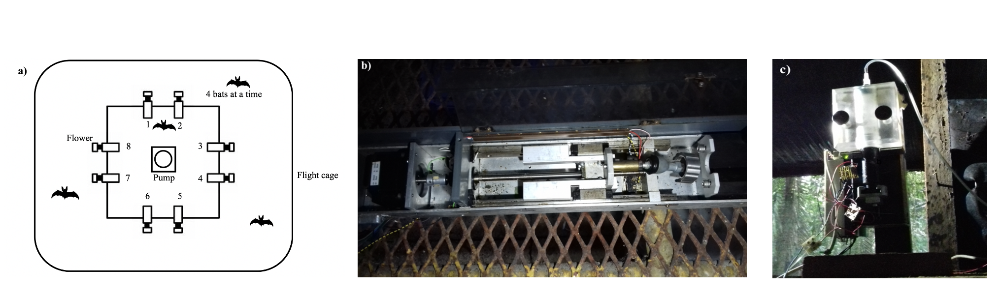

<style>
body {
text-align: justify}
</style>

---
```{r setup, include=FALSE}
knitr::opts_chunk$set(echo = FALSE, message = FALSE, warning = FALSE, fig.align = "center")
```

```{r Reading in the packages, echo = FALSE, include=FALSE, results= 'hide'}
# clearing the environment
rm(list = ls())

# creating a vector of the required packages 
# packages <- c("rmarkdown", "reshape2", "citr", "shiny", "flextable", "scales", "tidyverse", "lubridate", "ggpubr", "gridExtra",  "Hmisc", "brms", "bayesplot")
#sapply(packages, library, character.only = TRUE)

# installing the required packages if needed and loading them 
if (!require(rmarkdown)) 
install.packages(rmarkdown)
if (!require(reshape2)) 
install.packages(reshape2)
if(!require(rticles))
install.packages(rticles)
if (!require(knitr)) 
install.packages(knitr)
if (!require(citr)) 
install.packages(citr)
if (!require(shiny)) 
install.packages(shiny)
if (!require(flextable)) 
install.packages(flextable)
if (!require(scales)) 
install.packages(scales)
if (!require(tidyverse)) 
install.packages(tidyverse)
if (!require(lubridate)) 
install.packages(lubridate)
if (!require(ggpubr)) 
install.packages(ggpubr)
if (!require(gridExtra)) 
install.packages(gridExtra)
if (!require(Hmisc)) 
install.packages(Hmisc)
if (!require(brms)) 
install.packages(brms)
if (!require(bayesplot)) 
install.packages(bayesplot)

```

# Introduction 

*'Take some more tea,' the March Hare said to Alice, very earnestly.* 

*'I've had nothing yet,' Alice replied in an offended tone, 'so I can't take more.'*

*'You mean you can't take LESS,' said the Hatter: 'it's very easy to take MORE than nothing.'*

***- Alice's Adventures in Wonderland*****, Lewis Carroll**

The ability to recognize and respond appropriately to change is crucial to animals' survival. This ability is often referred to as cognitive or behavioural flexibility [@tello-ramos_spatial_2019], and can be seen in a range of behaviours in many different species: locating food in ants [@czaczkes_ants_2015]; spatial navigation in male guppies [@lucon-xiccato_sex_2017]; parental care in poison frogs [@ringler_flexible_2015]; and migratory behaviour in many vertebrates [@winkler_cues_2014]. One experimental protocol that has been widely used to demonstrate cognitive/behavioural flexibility is reversal learning. 

Reversal learning is essentially a specific type of discrimination learning, which is when animals must learn a specific, arbitrary response to each of multiple stimuli. In a reversal learning experiment an animal is first faced with a simultaneous choice between two stimuli, only one of which is paired with a reward. After a certain number of trials has occurred and the animal has likely learned the association between the correct stimulus and reward, the reward contingencies of the two stimuli are reversed. In a serial reversal learning procedure the reward contingencies reverse repeatedly. An animal that chooses the rewarded stimulus more frequently than the non-rewarded stimulus is judged to perform better on the task; a choice to the non-rewarded stimulus is, in the context of the task, an 'error'. 

The serial reversal learning protocol can be adapted to the behaviour and sensory physiology of many different species, thus allowing comparative research. It has been done using visual stimuli in bumblebees [@strang_serial_2014] and guppies [@boussard_brain_2020]; visual and spatial stimuli in corvids [@bond_serial_2007-1]; spatial stimuli in rats [@boulougouris_effects_2007], great tits [@hermer_elevation-related_2018] and gray squirrels [@chow_serial_2015]; and olfactory stimuli in rats [@kinoshita_effects_2008]. Reversal learning, specifically serial reversal, has been used as an explicit comparative measure of animal 'intelligence' [@bitterman_evolution_1964]: 'higher' animals like pigeons, rats and monkeys showed a progressive improvement on the task and 'lower' animals like turtles and fish did not. Though the idea of such a hierarchy is outdated, comparative research using reversal learning can reveal important differences in behaviour and learning that have evolved under the selection pressures faced by different species.

Learning in the reversal learning task is clearly demonstrable, and is therefore a meaningful criterion when comparing the performance of different animals. First-order learning happens when an animal learns the stimulus-reward association and changes its behaviour according to the strength of this reinforcement. Higher-order or second-order learning is the learning of rules or strategies; in serial reversal learning the same stimuli are successively paired with a reward and then not paired with a reward, so a strategy can be very profitable. The optimal rule in reversal learning is 'win-stay; lose-shift', which means in practice one 'error' per reversal. After learning the task, the perfectly optimal animal will first exclusively choose the stimulus that is paired with reward. At the first choice of this stimulus that does not give a reward (the error), the animal will change its preference and exclusively choose the other stimulus which is now paired with a reward. Progressive 'improvement' in this task, where an animal makes fewer and fewer errors per reversal is indication that the animal is learning the rule of reversal, or 'learning to learn' [@shettleworth_cognition_2010]. 

Comparative research from the primate literature reveals a very interesting difference in these two types of learning (first- and second-order). Thirteen different species of primates were compared on a visual reversal learning task [@rumbaugh_toward_1996], where they were trained to discriminate a pair of stimuli to either 67% or 84% choice for the rewarded option, and then given a single reversal of reward contingencies. If the primates' behaviour was driven mainly by first-order learning, they should make fewer errors after the reversal when the criterion was 67% rather than 84%, and *vice versa* if second-order learning or rule-learning was occurring. The results showed that Prosimian species tended to perform better when trained to 67%; apes when trained to 84%; and monkeys were intermediate. 

Progressive improvement on the serial reversal task as more reversals are experienced, evidence of rule-learning, has been shown in many different species: bumblebees [@strang_serial_2014], two different species of great tits [@hermer_elevation-related_2018] and three different species of corvids [@bond_serial_2007-1]. Corvids in fact show significant transfer across stimulus modality, which is strong evidence for rule-learning. 

What performance on the serial reversal task says about the deeper cognitive mechanisms at work, and whether the task is a measure of cognitive or behavioural flexibility, are not completely settled questions. Cognitive flexibility cannot be directly observed; it is inferred to have occurred through changes in behaviour, or behavioural flexibility [@tait_assessment_2018]. However, just because behavioural flexibility has been observed does not necessarily indicate cognitive flexibility [@dhawan_more_2019]. The term 'behavioural flexibility' itself has been used widely but inconsistently, applied to many traits that have different underlying neural mechanisms or do not co-vary [@audet_whats_2017]. Behavioural flexibility in animals has evolved in response to selection pressures from different foraging environments: the flexibility required to deal with seasonal changes in fruit availability is not the same kind of flexibility required to deal with capturing a prey animal intent on escaping. 

There is a sense in which the foraging ecology of some nectar-feeding animals is a natural analogue to the serial reversal learning task. The Neotropical bat species *Glossophaga commissarisi* relies primarily on flower nectar for energy. These bats have remarkably high metabolic rates for their body mass [@voigt_energetic_1999; @voigt_field_2006], due to the energetic demands of hovering flight [@winter_energy_1998; @v_helversen_nectar_1984]. As flowers yield only small droplets of nectar each time they are visited [@voigt_field_2006], the bats make several hundred flower visits per night. Many plants visited by bats put out only a few flowers every night that bloom for a long time [@kunz_bat_2005]. A certain time after a flower is emptied the nectar-levels are replenished, so bats can visit the same flower multiple times, relocating it primarily through their excellent spatial memory [@winter_foraging_2005; @toelch_effect_2008]. The longer the bat waits, the more the flower refills but the higher the likelihood that a competitor could find and exploit the flower first. To make repeated, profitable visits to a flower, a bat must remember both the location of the flower and estimate the flower's expected reward value. The serial reversal learning task requires an animal to respond to a change in the profitability of available options, and remember all potentially rewarding options: the kind of behavioural flexibility, in short, required in the typical foraging bout of a nectar-feeding bat. 

We carried out a serial reversal learning task with wild *G. commissarisi* individuals. Over three nights the bats were given two potentially rewarding options to choose between. At the start of the night, only one of the options was rewarding and the other was not. After a certain number of visits had been made by the bats, the reward contingencies reversed without any cue: the previously rewarding option was now unrewarding and the previously unrewarding option was rewarding. This reversal occurred five times a night on every night. 

Our aims with this experiment were as follows. Firstly, we wanted to test whether that the bats were capable of reversal learning. We believed this to be extremely likely as the behavioural requirements of the task are typical features of the animals' foraging ecology. Secondly, if the bats demonstrated the ability to respond to the reversals, we wanted to explore how this was reflected in their decision-making. What changes occurred in the relative number of visits made to the rewarding and the non-rewarding options? Thirdly, we wanted to see if the bats were capable of second-order learning, or 'learning to learn'. Could the bats learn the rule behind the change in their environment and use the optimal strategy of one error per reversal? 

After the analyses described above were done and the data and results examined, we performed further analyses to explore the conclusions of our confirmatory analyses. The difference between these results must be clearly noted. Firstly, we reasoned that there is a difference between the first visits of a night, before any experience of a reversal, and all the subsequent visits after at least one reversal had occurred. We statistically tested for this difference in the bats' choice behaviour. Secondly, we examined the effect of the asymptotic level of performance (the highest stable proportion of visits to the rewarding option after a reversal) on the performance immediately after a reversal. 

# Methods 

## Study site and subjects
The experiment was done from the 28th of June to the 25th of July, 2017, at La Selva Biological Field Station, Province Heredia, Costa Rica. Male and female individuals of the species *Glossophaga commissarisi*, were captured from the wild for the experiment. The bats were attracted to a particular location in the forest using sugar-water (see **Reward** below) as bait and then caught in mist-nets. The bats were sexed and the selected individuals were were then taken to two flight-cages (4 x 6 m). The flight-cages had mesh walls and therefore the same climatic conditions as the surrounding environment. A group of four bats at a time were put into a flight cage. All the individuals in a group were the same sex. The bats were weighed and radio frequency identification (RFID) tags that were uniquely assigned to each bat were placed around their necks as collars. The bats were then released into the flight-cages so they could fly within them freely. 

Before the start of the experiment the procedure was tested with four females and refinements were made to the procedure. The data from these individuals were not analyzed. 16 bats participated in the main experiment. At the end of the experiment, the RFID collars were removed and the bats were weighed to make sure they were still at a healthy weight. No blinding was done as all the data collection was completely automatized. Two of the bats did not drink a sufficient amount of sugar-water to meet minimum energy requirements and were released before the end of the experiment and not replaced. The data from these two individuals were not analyzed. Thus, 14 bats in total (seven males and seven females) completed the experiment and the data from these animals were analyzed. 

Animal experimental procedures were reviewed and permission for animal experimentation and RFID-tagging was granted by Sistema Nacional de Areas de Conservación (SINAC) at the Ministerio de Ambiente y Energía (MINAE), Costa Rica.

## Experimental Setup
### Reward
The reward received by the bats during the experiment was also their main source of food. The reward was a 17% by weight solution of sugar dissolved in water (prepared fresh everyday), hereafter referred to as 'nectar'. The sugar consisted of a 1:1:1 mass-mixture of sucrose, fructose and dextrose. The nectar was thus similar in composition and concentration to the nectar produced by wild chiropterophilous plants [@baker_sugar_1998].

### Flower and pump setup
Each flight cage had a square plastic frame in the center (2x2x1.5m). Eight reward-dispensing devices - hereafter referred to as 'flowers' - were fixed in a radial pattern on this frame, two on each side of the square (see **Figure 1**) with a distance of 40 cm between adjacent flowers. This is a distance the bats can discriminate [@thiele_hierarchical_2005]. Each flower had the following parts: an RFID reader mounted on a plastic cylinder around the head of the flower; an infra-red light-barrier beam; an electronic pinch valve through which a PVC tube was placed and fixed to the head of the flower

A stepper-motor pump was placed in the center of the plastic frame in each cage. The pumps contained a 25 mL Hamilton glass syringe (Sigma Aldrich). The precision of the two pumps differed slightly: the pump in Cage 1 delivered `r round(40/19, digits = 2)` $\mu$L per step of the stepper-motor, and the pump in Cage 2, `r round(40/12, digits = 2)` $\mu$L per step. The glass syringe was connected to the tubing system of the flowers through five pinch valves. The pinch valves controlled the flow of liquid from the pump to the system and from a reservoir of liquid to the pump. The reservoir (500 mL thread bottle, Roth, Germany) was filled with fresh nectar everyday and connected to the syringe through the valves. 

When a tagged bat approached a flower, the individual RFID number was read by the reader. If the bat then poked its nose into the flower and broke the light barrier, it triggered the release of a reward. The pinch valve opened and the pump moved the correct number of pre-programmed steps to dispense nectar to the head of the flower. The bat could easily hover in front of the flower and lick up the nectar. Only when both events occurred, i.e., the RFID reader detected a bat and the light-barrier was broken, would a reward be triggered.

The flowers and the pump were connected to a Lenovo ThinkPad laptop computer, which ran the experimental programs and the programs used to clean and fill the systems: PhenoSoft Control 16, PhenoSoft GmBH, Berlin, Germany. The raw data were recorded to this computer as comma-separated values (CSV) files.

```{r, fig.cap= "a) Schematic of the cage and flower set-up b) Horizontal pump c) Vertical pump"}



```

## Experimental procedure
Every day at around 1000 h the old nectar was emptied from the system. The system was rinsed and filled with plain water until 1500 h , when it was filled again with fresh nectar. Twice a week the system was filled with 70% ethanol for an hour to prevent microbial growth, then repeatedly rinsed with water. 

Four bats were placed in a flight-cage in a group, and all the bats were the same sex. There were four such groups in total, and data were collected simultaneously from two groups, one in each flight-cage. Each bat was uniquely assigned two adjacent flowers on the same side of the square frame, out of the array of eight. These flowers were programmed to reward only one of the four bats in the cage. After the system was filled with fresh nectar at approximately 1700 h, the program was left running for data-collection till the next morning. Thus, the bats could begin visiting the flowers to collect a reward whenever they chose, which was at approximately 1800 h every night. 

```{r Calculating the time taken for the pump to fill up, message = FALSE, warning = FALSE, message = FALSE, echo=FALSE, results='hide'}

# reading in the pre-processed data to demonstrate the pump fill time 
raw_data_preproc <- read.csv2("data/processed_data/raw_data_all.csv", sep = ";", header = TRUE)

# creating a vector of the bats to be excluded from the main analysis
bats_incomp <- c("Bat7", "Bat19")

# creating a vector with the beta bats
bats_beta <- c("Bat1", "Bat2", "Bat3", "Bat4")

# creating a vector of the main experimental days
main_days <- c("Day 1", "Day 2", "Day 3")

# calculating the time for each refill event
pump_time <- raw_data_preproc %>% 
  filter(day < 4) %>% 
  group_by(Cage) %>% 
  arrange(DateTime) %>% 
  filter(MsgValue1 == "start pump" | MsgValue1 == "end pump") %>% 
  mutate(interval = ifelse(MsgValue1 == "start pump", as.numeric(difftime(lead(DateTime), DateTime, units = "secs")), "non-fill time")) %>% 
  select(DateTime, IdLabel, Condition, Cage, MsgValue1, interval) %>% 
  arrange(DateTime) %>% 
  filter(Condition == "SerialReversalCounter", 
         interval != "non-fill time", 
         interval < 300) %>% 
  mutate(interval = as.integer(interval)/60) %>% 
  summarise(mean_filltime = round(mean(interval), digits = 2),  
            sd_filltime = round(sd(interval), digits = 2))

# counting the number of fill events per night: there is exactly one so the R code is not cited in the main text
pump_fills <- raw_data_preproc %>% 
  filter(Condition == "SerialReversalCounter") %>% 
  arrange(DateTime) %>% 
  group_by(Group, day) %>% 
  mutate(hour = hour(DateTime)) %>% 
  filter(!IdLabel %in% bats_incomp,
         !IdLabel %in% bats_beta,  
         day < 4, 
         hour > 18 | hour < 6, 
         MsgValue1 == "start pump") %>%
  summarise(pump_events = n()) %>% 
  ungroup() %>% 
  summarise(fill_events = mean(pump_events))
```

```{r, Calculating the proportion of wrongly unrewarded visits, message = FALSE, warning = FALSE, message = FALSE, echo=FALSE, results='hide'}
#----------------------------------
# Reading in and preparing the data
#----------------------------------
# loading the prepared CSV file of raw data
raw_data <- read.csv2(file = "data/processed_data/Raw_data_bats.csv", sep = ";", header = TRUE)

# The following terms are used in the analysis of the data:
# 1. Day: a single experimental night during which the data were collected
# 2. block: a group of 50 visits between each reversal where the same flower is rewarding
# 3. bin: a smaller group of visits within a block, the size of which can be set in the code below
# 4. visits: each individual flower visit

# setting binsize and breaks for cutting up the data into block and bin
binsize <- 10
breaks <- seq (0, 3000, binsize)

# placing the visits made by the beta bats in a separate data frame

rev_learning_all_beta <- raw_data %>% 
  filter(IdLabel %in% bats_beta)

# placing the visits made on days 4, 5 and 6 in a separate data frame 

rev_learning_all_lastdays <- raw_data %>%
  filter(!day %in% main_days)

# preparing a data frame with all the visits, including the proper but unrewarded ones 
rev_learning_all_unrew <- raw_data %>%
  filter(
    # removing the bats that did not complete the experiment
    !IdLabel %in% bats_incomp,
    !IdLabel %in% bats_beta, 
    day %in% main_days, 
    # filtering out the main experimental data
    Condition == "SerialReversalCounter"
  ) %>%
  mutate(
    # marking the difference between the normal visits in a block and the switch points
    MsgValue1 = ifelse(MsgValue1 == "switch", MsgValue1, "block"),  
    # making a column to mark the unrewarded proper visits 
    reinforce1value = replace_na(reinforce1value, 0),
    reinforce1Account = replace_na(reinforce1Account, 0), 
    Unrew = ifelse(reinforce1value != reinforce1Account, 1, 0)
  ) %>%
  rename(Bat = IdLabel) %>%
  arrange(Group, day, Bat, DateTime) %>%
  # grouping the data to count the visits, noting the reversals separately
  group_by(Bat, day) %>%
  mutate(
    # creating a column with the total number of visits made by a bat per day
    count_vis = ifelse(MsgValue1 == "switch", 0, 1), 
    count_vis = cumsum(count_vis)
  ) %>%
  # setting the maximum number of visits a night higher than the programmed max to allow for the 
  # unrewarded visits
  filter(count_vis <= 350) %>%
  ungroup()

# adding the reversal block numbers and marking the reversals for the dataset with the unrewarded visits
rev_learning_all_unrew <- rev_learning_all_unrew %>% 
  # creating a column with the reversal block number, marking the reversals
  mutate(block = ifelse(MsgValue1 == "switch", 1, 0)) %>%
  group_by(day, Bat) %>%
  mutate(block = cumsum(block)) %>%
  ungroup() %>% 
  group_by(day, Bat, block) %>%
  # creating a column with the number of visits within each block
  mutate(block_vis = ifelse(MsgValue1 == "switch", 0, 1), 
         block_vis = cumsum(block_vis), 
         # creating a new column for visits in each block to be binned
         bin = "") %>%
  ungroup() %>%
  group_by(day, Bat, block) %>%
  # cutting the visits inside each block into bin of the size set earlier
  mutate(bin = as.numeric(cut(block_vis, breaks, include.lowest = TRUE)))

# adding a reward status to the table 
rev_learning_all_unrew <- rev_learning_all_unrew %>% 
  mutate(reward_status = ifelse(reinforce1value == 0 | Unrew == 1, 0, 1)) %>% 
  filter(!Bat %in% bats_beta, 
         day %in% main_days)

# what percentage of the bats' visits are wrongly unrewarded? 
mean_unrew <- rev_learning_all_unrew %>% 
  group_by(Bat, Day) %>% 
  filter(MsgValue1 != "switch") %>% 
  summarise(mean_unrew = mean(Unrew)) %>% 
  mutate(mean_unrew = mean_unrew *100)

overall_mean_unrew <- round(as.numeric(mean(mean_unrew$mean_unrew), digits = 2))
overall_sd_unrew <- round(as.numeric(sd(mean_unrew$mean_unrew)), digits = 2)

```

During the course of the night, when the syringe of the pump had been emptied, the pump re-filled automatically. This event happened only once every night. On the main experimental days this process took `r as.numeric(pump_time[1, 2])` minutes (SD = ±`r as.numeric(pump_time[1 ,3])`) for the horizontal pump, and `r as.numeric(pump_time[2, 2])` minutes (SD = ±`r as.numeric(pump_time[2, 3])`) for the vertical pump. About `r overall_mean_unrew` % (SD = ±`r overall_sd_unrew`) of all visits made by the bats over all three experimental nights happened during the pump refill events, and the bats did not receive any reward on these visits, even if they were made to the rewarding flower. 

Every night the bats were also given ad-libitum supplemental food: 3.5g of hummingbird food (NektarPlus, Nekton) in 100 mL of water and 3.5g of milk powder (Nido 1+, Nestle) in 100 mL of water. They were also given a small bowl of locally-sourced bee pollen. 

## Experimental design
The experiment proceeded through the following stages. 

### Training to use a flower 

On the night the naive bats were captured and placed into the flight cages they could receive a reward from any of the flowers whenever they visited them throughout the night. To enable the bats to find the flowers a small cotton pad was placed on the flowers, soaked in di-methyl di-sulphide. This is a chemical attractant produced by many bat-pollinated flowers [@von_helversen_sulphur-containing_2000]. A small drop of honey was applied to the inside of the flowers to encourage the bats to place their heads inside, break the light-barrier and trigger a nectar reward. By the end of the night all the bats had found the flowers and learned to trigger rewards quickly. 

### Training to use two specific flowers

After the bats had learned to trigger rewards, the next stage of training involved assigning the bats uniquely to two out of the eight flowers in the array. For an individual animal only the two flowers assigned it would be rewarding from this stage of training until the end of the experiment. Because the bats had already learned to trigger a reward at the flowers, the flowers were not provided with a cotton piece with the chemical attractant and honey was not applied to them. This stage was similar to the previous one, except the bats could only trigger a reward at their assigned flowers.

### Alternation

To ensure that the bats were familiar with both flowers assigned to them they went through one final stage of training: forced alternation between the two assigned flowers all night long. 

### Main Experiment

In this serial reversal learning task the bats had to choose between a flower that gave 40 $\mu$L of nectar and one that gave no reward at all. The location of the rewarding flower was not cued, but through the Alternation phase of training each bat knew the locations of both flowers that were potentially rewarding to it. After a bat had made 50 visits in total to the two flowers a reversal occurred: the previously rewarding flower became the non-rewarding flower and *vice versa*. Importantly, only visits to the two flowers assigned to a bat counted towards the visit tally, not visits to any of the other flowers which were unrewarding to that particular bat. The batch of 50 visits that occurred between two consecutive reversals (when the locations of the rewarding and unrewarding flowers remained stable) was termed a 'reversal block', including the first 50 visits of a night when the bats had not experienced any reversal at all that night. This occurred at regular intervals of 50 visits until the bat either stopped making visits or reached a maximum of 300 visits in a night. After the bat had made 300 rewarded visits it could no longer receive a reward on that experimental night. There were five reversals per night. This stage of the experiment was repeated for three nights in a row. The same flower was the first to be rewarding at the start of every night. Thus, because there were five reversals every night (six blocks of 50 visits), if a bat completed the maximum of 300 visits on a night, the last flower to be rewarding that night was non-rewarding at the start of the next night. 

## Statistical analysis 

All the models were fit in a Bayesian framework using Hamiltonian Monte Carlo in the R package `brms` [@burkner_brms_2017], which is a front-end for `rstan` (Stan Development Team, 2020).

All the visits made by the bats during a night, up to a maximum of 300, were included in the analyses. There were three experimental nights, divided into six blocks of 50 visits each. At the end of the first five blocks a reversal occurred and the end of the last block was the end of data-collection for the night. Each block was further divided into five bins, each consisting of ten visits, in order to examine the bats' behaviour within each block. 

We defined a perseverative visit as a visit to the previously-rewarding option just after the occurrence of a reversal, until the first visit to the newly-rewarding option. By definition this could not happen in the first block of a night. A generalized linear mixed-model was used to investigate the effect of experimental night and reversal block on the number of perseverative visits. A negative-binomial likelihood function was used for this model. Experimental night, reversal block and their interaction were fixed effects and random slopes and intercepts were used to fit regression lines for each individual animal. 

We also examined the proportion of visits made to the rewarding flower. This was defined as the ratio of the number of visits to the rewarding flower divided by the total number of visits in a bin. The total number of visits in a bin only included visits made to the two flowers assigned to a bat and any visit to a flower that was not assigned was not considered in the analysis. The model was fit using a binomial likelihood function, with experimental night, block, bin and their interactions as fixed effects; random slopes and intercepts were used to fit regression lines for the individuals. 

After examining the above results, further analyses were done. It is important to note that these were *exploratory*, and the ideas were suggested to us by the results of the intended analyses described above. 

A second model was fit to the proportion of visits to the rewarding flower to take into account the fact that the first night and the first block of each night were qualitatively different from the others. On the first night the animals had had no prior experience of any reversals, and during the first block of every night they had not experienced any reversals on that night, and this was reflected in the fit of the posterior predictions made from the first model. The second model of these data was identical to the first except for the addition of experimental night and block as factor variables, with the first night and the first block of every night as one level and the other nights and other blocks of each night as the other level. The two models were compared using leave-one-out cross-validation, implemented in `brms` using the package `loo` [@vehtari_practical_2017]. 

We reasoned that a comparison of the bats' behaviour just before and after a reversal might reveal something of the learning mechanisms at work. If a higher proportion of visits to the rewarding flower just before a reversal is predictive of a higher proportion of visits to the rewarding flower just after, that might potentially indicate that the bats are learning the 'rule' behind the reversals. On the other hand, if there is no rule-learning, and the animals' choice is driven by how much reinforcement was received at the two options, we would expect the opposite: the proportion of visits to the rewarding flower before the reversal is predictive of a *lower* proportion of visits to it just after as the animals take longer to 'reverse' their choices from a highly reinforced option. We took the proportion of visits to the rewarding option, averaged over the last three bins of a reversal block for each individual as the 'asymptote' of the bats' choice behaviour. We fit a generalized linear-mixed model with the proportion of visits to the rewarding option the first bin just after a reversal as the response variable with the fixed effects asymptote, a continuous variable, and night, a factor variable. Random slopes and intercepts were used to fit regression lines for each individual animal. 

Weakly informative priors were used. The random intercepts and slopes were given a Normal distribution with a mean of 0, and a standard deviation drawn from a Cauchy distribution with a mean of 0 and a standard deviation of 1. All the models were estimated using 4 chains with a thinning interval of 3, with 1200 warm-up samples and 1300 post-warm-up samples for the model with the first experimental night and block additionally treated differently; 2000 warm-up samples and 2000 post-warm-up samples for the model of the first bin of 10 visits after a reversal; and 1000 warm-up samples and 1000 post-warm-up samples for the others. 

Visual inspection of the trace plots, the number of effective samples, the Gelman-Rubin convergence diagnostic ($\hat R$) and the calculation of posterior predictions for the same clusters were all used to assess the fit of the models. In all of the models the $\hat R$ was equal to 1 for all the chains. 

The data from all 14 bats that participated in the three experimental nights were included in these models, even though some individuals did not complete all 300 visits on every single night. 

All statistical analyses and creation of plots were done in R. 

## Data availability 
All data and analysis code are available online at ..... 

# Results 

## Confirmatory Analyses

### Explanatory paragraph
**This paragraph is just for our guidance and will be removed later: it is an overall summary of the conclusions we draw from all of the analyses, i.e., the story we are building.**
  
  **Confirmatory analyses**: As bats experience serial reversals they show a more rapid switch to the rewarding option after a reversal, and an overall increase in the proportion of visits made to the rewarding option. This overall increase was smaller with each successive reversal.

**Exploratory analyses**: The largest proportion of visits to the rewarding option was made every night before the bats had experienced any reversals. The higher the asymptote the longer the bats took to reverse, but this negative relationship varied by night and almost disappeared on the second night. 

**In conclusion**: Experiencing serial reversal of reward, nectar-feeding bats learn that reversal can occur in their environment: we know this because they switch more rapidly; reach a higher proportion of visits to the rewarding option with a 'ceiling effect'; and sample a little more once they have experienced a reversal on a day

### a) Bats made a very high proportion of their visits to the rewarding option after reversals
```{r, Reading in and preparing the main data, include = FALSE}
#----------------------------------------
# Preparing data from the main experiment
#----------------------------------------
# making a separate data frame without any unrewarded visits and preparing it further with block and bin numbers
rev_learning_all <- rev_learning_all_unrew %>% 
  filter(Unrew == 0) %>%
  select(-Unrew) %>%
  # grouping the data to count the visits, noting the reversals separately
  group_by(Bat, day) %>%
  mutate(
    # noting whether the bat made a visit to the more or less rewarding flower
    reward_status = ifelse(reinforce1value > 0, 1, 0),
    # creating a column with the total number of visits made by a bat per day
    count_vis = ifelse(MsgValue1 == "switch", 0, 1), 
    # taking the cumulative sum of the visit counts 
    count_vis = cumsum(count_vis)
  ) %>%
  # setting the maximum number of visits a night
  filter(count_vis <= 300) %>%
  ungroup() %>%
  # creating a column with the reversal block number, marking the reversals
  mutate(block = ifelse(MsgValue1 == "switch", 1, 0)) %>%
  group_by(day, Bat) %>%
  mutate(block = cumsum(block)) %>%
  ungroup() %>% 
  group_by(day, Bat, block) %>%
  # creating a column with the number of visits within each block
  mutate(block_vis = ifelse(MsgValue1 == "switch", 0, 1), 
         block_vis = cumsum(block_vis), 
         # creating a new column for visits in each block to be binned
         bin = "") %>%
  ungroup() %>%
  group_by(day, Bat, block) %>%
  # cutting the visits inside each block into bin of the size set earlier
  mutate(bin = as.numeric(cut(block_vis, breaks, include.lowest = TRUE)))
#----------------------------------------------------------------------------------------
# Calculating the proportion of visits to the rewarding option averaged over all the bats
#----------------------------------------------------------------------------------------
# averaging the bats' choice behaviour over day, block and bin
rev_learning_avg <- rev_learning_all %>%
  group_by(day, block) %>%
  mutate(n_bats = n_distinct(Bat)) %>% 
  group_by(day, block, n_bats, bin) %>% 
  # calculating the 95% confidence intervals 
  group_modify(~ mean_cl_boot(.x$reward_status, conf.int = 0.95)) %>%
  ungroup() %>%
  group_by(day) %>%
  mutate(
    day_bin = 1:n(),
    day_bin_vis = day_bin * binsize,
    reversal = ifelse(block != lead(block), "switch", "block")
  )

# creating a look-up table so the reversals can be marked 
rev_main_avg <- rev_learning_avg %>%
  filter(
    reversal == "switch",
    day %in% main_days
  ) %>%
  select(day, block, day_bin, day_bin_vis) %>% 
  mutate(day = case_when(day == "Day 1" ~ "Night 1", 
                         day == "Day 2" ~ "Night 2", 
                         day == "Day 3" ~ "Night 3"))

# calculating the sample size in each block 
bat_labels <- rev_learning_avg %>% 
  select(day, block, n_bats) %>%
  distinct() %>% 
  group_by(day, block) %>% 
  mutate(day_bin_vis = ifelse(block == 1, 25, 50)) %>%
  ungroup() %>% 
  group_by(day) %>% 
  mutate(day_bin_vis = cumsum(day_bin_vis)) %>% 
  filter(day %in% main_days) %>%
  mutate(day = case_when(day == "Day 1" ~ "Night 1", 
                         day == "Day 2" ~ "Night 2", 
                         day == "Day 3" ~ "Night 3"))

# calculating and saving the values for the proportion of visits to the rewarding option in some of the bins 
day1bin1 <- rev_learning_all %>% 
  ungroup() %>% 
  filter(day == "Day 1", 
         block == 1, 
         bin == 1) %>% 
  mutate(reward_status = reward_status * 100) %>% 
  group_modify(~ mean_cl_boot(.x$reward_status, conf.int = 0.95)) %>% 
  mutate(y = round(y, digits = 1), 
         ymin = round(ymin, digits = 1), 
         ymax = round(ymax, digits = 1))

day1bin2 <- rev_learning_all %>% 
  ungroup() %>% 
  filter(day == "Day 1", 
         block == 1, 
         bin == 2) %>% 
  mutate(reward_status = reward_status * 100) %>% 
  group_modify(~ mean_cl_boot(.x$reward_status, conf.int = 0.95)) %>% 
  mutate(y = round(y, digits = 1), 
         ymin = round(ymin, digits = 1), 
         ymax = round(ymax, digits = 1))

day1bin5 <- rev_learning_all %>% 
  ungroup() %>% 
  filter(day == "Day 1", 
         block == 1, 
         bin == 5) %>% 
  mutate(reward_status = reward_status * 100) %>% 
  group_modify(~ mean_cl_boot(.x$reward_status, conf.int = 0.95)) %>% 
  mutate(y = round(y, digits = 1), 
         ymin = round(ymin, digits = 1), 
         ymax = round(ymax, digits = 1))

day1bin6 <- rev_learning_all %>%
  ungroup() %>% 
  filter(day == "Day 1", 
         block == 2, 
         bin == 1) %>% 
  mutate(reward_status = reward_status * 100) %>% 
  group_modify(~ mean_cl_boot(.x$reward_status, conf.int = 0.95)) %>% 
  mutate(y = round(y, digits = 1), 
         ymin = round(ymin, digits = 1), 
         ymax = round(ymax, digits = 1))

day1bin10 <- rev_learning_all %>% 
  ungroup() %>% 
  filter(day == "Day 1", 
         block == 2, 
         bin == 5) %>% 
  mutate(reward_status = reward_status * 100) %>% 
  group_modify(~ mean_cl_boot(.x$reward_status, conf.int = 0.95)) %>% 
  mutate(y = round(y, digits = 1), 
         ymin = round(ymin, digits = 1), 
         ymax = round(ymax, digits = 1))

day1last3bins <- rev_learning_all %>% 
  ungroup() %>% 
  filter(day == "Day 1", 
         block > 1, 
         bin > 2) %>% 
  mutate(reward_status = reward_status * 100) %>% 
  group_modify(~ mean_cl_boot(.x$reward_status, conf.int = 0.95)) %>% 
  mutate(y = round(y, digits = 1), 
         ymin = round(ymin, digits = 1), 
         ymax = round(ymax, digits = 1))

day2and3bin1 <- rev_learning_all %>% 
  ungroup() %>% 
  filter(day != "Day 1", 
         block == 1, 
         bin == 1) %>% 
  mutate(reward_status = reward_status * 100) %>% 
  group_modify(~ mean_cl_boot(.x$reward_status, conf.int = 0.95)) %>% 
  mutate(y = round(y, digits = 1), 
         ymin = round(ymin, digits = 1), 
         ymax = round(ymax, digits = 1))

day2and3lastbins <- rev_learning_all %>% 
  ungroup() %>% 
  filter(day != "Day 1", 
         block > 1, 
         bin > 2) %>% 
  mutate(reward_status = reward_status * 100) %>% 
  group_modify(~ mean_cl_boot(.x$reward_status, conf.int = 0.95)) %>% 
  mutate(y = round(y, digits = 1), 
         ymin = round(ymin, digits = 1), 
         ymax = round(ymax, digits = 1))
```

At the start of the first night, in the very first bin of ten visits when the bats did not yet have any information about the available options and had never experienced a reversal, the proportion of visits to the rewarding option averaged over the bats was close to chance: `r day1bin1$y` %, 95% CIs [`r day1bin1$ymin`, `r day1bin1$ymax`]. Within the next ten visits, however, this proportion increased to `r day1bin2$y` %, 95% CIs [`r day1bin2$ymin`, `r day1bin2$ymax`] and by the last bin of this first block was `r day1bin5$y` %, 95 % CIs [`r day1bin5$ymin`, `r day1bin5$ymax`]. Immediately after the first experience of a reversal, this proportion dropped down to `r day1bin6$y`%, 95% CIs [`r day1bin6$ymin`, `r day1bin6$ymax`] in the first ten visits, but came back up to `r day1bin10$y`%, 95% CIs [`r day1bin10$ymin`, `r day1bin10$ymax`] by the last bin of this block. This pattern of a decrease in the average proportion of visits to the rewarding option of all the bats immediately following a reversal, and then a rapid increase, was consistently true for all the reversals on the first night (**Figure 5**). Indeed, the proportion of visits to the rewarding option in the last 3 bins of a reversal block was `r day1last3bins$y` %, 95% CIs [`r day1last3bins$ymin`, `r day1last3bins$ymax`] on the first night, even excluding the first block before any reversal experience.
At the very start of the second and third nights, in the first bin of visits before any experience of a reversal *on that night*, the average proportion of visits to the rewarding option of all the bats was `r day2and3bin1$y` %, 95% CIs [`r day2and3bin1$ymin`, `r day2and3bin1$ymax`]. However the average proportion of visits to the rewarding option still showed the pattern of a decrease immediately after a reversal and then increase to a high proportion. On nights 2 and 3, after the bats had experienced the first reversal of the night, the average proportion of visits to the rewarding option in the last three bins of a reversal block was `r day2and3lastbins$y` %, 95% CIs [`r day2and3lastbins$ymin`, `r day2and3lastbins$ymax`], comparable to the `r day1last3bins$y` %, 95% CIs [`r day1last3bins$ymin`, `r day1last3bins$ymax`] on the first night.

### b) Bats switch to the rewarding option faster as they experience more reversals

A visit to a non-rewarding flower after a reversal, before the first experience of a reward at the newly-rewarding option was called a perseverative visit. Our analysis showed that both experimental night and block had a negative effect on the number of perseverative visits made by the bats. As the bats experience more reversals on more nights the number of perseverative visits decreased. The interaction of night and block, however, was positive: the decrease in the number of perseverative visits was smaller as the bats experienced more experimental nights (**Figure 3**).  

```{r, message = FALSE, warning = FALSE, echo = FALSE, fig.cap = "Number of perseverative visits made by the bats after each reversal across all three nights. A perseverative visit was defined as visit to the previously-rewarding option before the first visit to the newly-rewarding option after a reversal. By definition there were no perseverative visits in the first block of a night. The red lines are the perseverative visits made by the individual bats after each reversal of a night; the black lines are the number of perseverative visits averaged over the bats", fig.width = 6, fig.height = 3}
#---------------------------------------------------
# Plotting the perseverative visits made by the bats
#---------------------------------------------------
pers_visits <- rev_learning_all %>% 
  select(-c(Group, Cage, Condition, Day, IdRFID, SystemMsg)) %>% 
  filter(block_vis != 0) %>% 
  group_by(Bat, day, block) %>% 
  mutate(first_rew = cumsum(reward_status)) %>% 
  filter(block > 1, 
         first_rew == 1, 
         reward_status == 1) %>% 
  ungroup() %>%
  group_by(day, block) %>% 
  mutate(mean_vis = mean(block_vis))

p2 <- pers_visits %>% 
  filter(day %in% main_days) %>% 
  mutate(day = case_when(day == "Day 1" ~ "Night 1", 
                         day == "Day 2" ~ "Night 2", 
                         day == "Day 3" ~ "Night 3"), 
         block = block - 1) %>% 
  ggplot(aes(block)) + 
  geom_line(aes(y = block_vis, group = Bat, color = "red"), alpha = 0.5) + 
  geom_line(aes(y = mean_vis), color = "black") + 
  facet_grid(.~day) + 
  ylim(0, 18) + 
  theme_bw() + 
  theme(legend.position = "none") + 
  ylab("Number of perseverative visits") + 
  xlab("Reversal number")

p2
```

```{r, message = FALSE, warning = FALSE, message = FALSE, echo=FALSE, fig.cap = "Forest plot of the estimates of the effect of night and block on perseverative visits; a negative effect indicates the perseverative visits decreased with successive nights and blocks. The circles represent the slope estimates, the thick horizontal lines represent the 50% credible intervals and the thin horizontal lines 95% credible intervals. The numbers are the slope estimates and the 95% credible intervals of each effect", fig.width = 7, fig.height = 1.5}
#---------------
# Model fitting 
#---------------
# preparing the data table for the analysis of the perseverative visits 
analysis_pers <- rev_learning_all %>% 
  ungroup() %>% 
  select(Day, block, Bat, reward_status, block_vis, count_vis) %>%
  filter(block_vis != 0) %>% 
  group_by(Bat, Day, block) %>% 
  mutate(first_rew = cumsum(reward_status)) %>% 
  filter(block > 1, 
         first_rew == 1, 
         reward_status == 1)

# fitting a random slopes and random intercept model to the data, examining the effects of day, block and bin on the number of perseverative visits following a reversal; the response variable is taken to follow a negative-binomial distribution, which assumes that each Poisson count variable has its own rate parameter 

# m_pers <-
#   brm(data = analysis_pers, family = negbinomial,
#       block_vis ~ Day + block + Day:block + (1 + Day + block| Bat),
#       prior = c(prior(normal(0, 10), class = Intercept),
#                 prior(normal(0, 10), class = b),
#                 prior(cauchy(0, 1), class = sd)),
#       iter = 2000, warmup = 1000, chains = 4, cores = 4, thin = 3, 
#       control = list(adapt_delta = 0.999, 
#                      max_treedepth = 12),
#       seed = 12)
# 
# save(m_pers, file = "03_stats_rs_m4_negbinom.rda")
load("data/processed_data/03_stats_rs_m4_negbinom.rda")
#m_pers <- read.csv2(file = "data/m_pers.csv", sep = ";", header = TRUE)

# renaming the model appropriately
m_pers <- m3.1.1

# removing the model with the misleading name 
rm(m3.1.1)
# setting the colour scheme 
color_scheme_set("darkgray")

#model summary
t1 <- fixef(m_pers) %>% 
  as_tibble() %>% 
  mutate("Fixed effect" = c("Intercept", "Night", "Block", "Night-Block Interaction"), 
         Estimate = round(Estimate, digits = 2), 
         Q2.5 = round(Q2.5, digits = 2), 
         Q97.5 = round(Q97.5, digits = 2)) %>% 
  # renaming the credibility intervals column
  mutate("95% Credibility intervals" = paste0("[", Q2.5, " , ", Q97.5, "]"))

max_xvalue <- t1 %>% 
  filter(`Fixed effect` != "Intercept") %>% 
  select(Q97.5) %>% 
  filter(Q97.5 == max(Q97.5)) %>% 
  as.numeric() 

max_xvalue <- max_xvalue + 0.3

t1_estimates <- t1 %>% 
  filter(`Fixed effect` != "Intercept") %>% 
  rename(labels = `Fixed effect`) %>% 
  select(labels, Estimate, `95% Credibility intervals`) %>% 
  mutate(All = paste0(Estimate, " ", `95% Credibility intervals`)) %>% 
  select(labels, All)

# creating a plot of the slope coefficients 
p3 <- mcmc_intervals(m_pers, 
                     pars = vars(2:4), 
                     prob_outer = 0.95, 
                     point_size = 1.75) + 
  xlim (-0.9, max_xvalue+0.05) +
  geom_vline(xintercept = 0) + 
  scale_y_discrete(
    labels = c("b_Day" = "Experimental night",
               "b_block" = "Reversal block", 
               "b_Day:block" = "Night - block interaction"),
    limits = c("b_Day:block", "b_block", "b_Day")) + 
  geom_text(data = t1_estimates,
            aes(x = max_xvalue, y = c(3, 2, 1), label = All, fontface ="bold"), size = 3)

p3 

```

```{r, message = FALSE, warning = FALSE, message = FALSE, echo=FALSE, fig.cap = "A comparison of the posterior predictions of the generalized linear mixed-effects model of perseverative visits and the empirical data from the bats. The red line indicates the number of perseverative visits per reversal made by the bats; the blue line indicates the corresponding posterior prediction of the model with the blue shading indicating 95% confidence intervals", fig.width = 9.5, fig.height = 3}

# calculating the posterior predictions 
# selecting the required columns from the analysis dataframe 
nd_pers <- analysis_pers %>% 
  select(Bat, Day, block)

# calculating the posterior predictions 
post_fit <-
  fitted(m_pers,
         newdata = nd_pers) %>% 
  as_tibble() %>% 
  mutate(Bat = analysis_pers$Bat, 
         Day = analysis_pers$Day,
         block = analysis_pers$block, 
         count_vis = analysis_pers$block_vis)

# calculating the empirical equivalents of the posterior predictions 
comparison_pers <- analysis_pers %>% 
  group_by(Bat, Day, block) %>% 
  group_modify(~ mean_cl_boot(.x$block_vis, conf.int = 0.95))

# putting the calculated posterior values and the empirical values into the same table
comparison_pers <- left_join(analysis_pers, post_fit, by = c("Bat", "Day", "block"))

# plotting the posterior predicted values and empirical values together 
p3 <- comparison_pers %>% 
  mutate(Day = case_when(Day == 1 ~ "Night 1", 
                         Day == 2 ~ "Night 2", 
                         Day == 3 ~ "Night 3"), 
         block = block - 1) %>% 
  ggplot(aes(block)) + 
  #geom_point(aes(y = y), color = "red", size = 0.2) +
  geom_line(aes(y = block_vis), color = "red") + 
  #geom_ribbon(aes(ymin = ymin, ymax = ymax), fill = "red", alpha = 0.3) + 
  geom_point(aes(y = Estimate), color = "blue", size = 0.2) + 
  geom_line(aes(y = Estimate), color = "blue") + 
  geom_ribbon(aes(ymin = Q2.5, ymax = Q97.5), fill = "blue", alpha = 0.3) +
  xlab("Reversal number") + 
  ylab("Number of perseverative visits") + 
  facet_grid(Day ~ Bat) + 
  theme_bw()

p3

```

### c) The bats make more visits to the rewarding option as they experience more reversals

The proportion of visits to the rewarding option was modeled as an effect of experimental night, block and bin. This analysis showed that night, block and bin all had a positive effect on the proportion of visits to the rewarding option: as the bats experience more reversals on more nights, and the more visits made since the occurrence of a reversal, the proportion of visits made to the rewarding option increased. 
Interestingly the slopes of the interactions of experimental night and block; block and bin within the block; and experimental night and bin within the block were all negative. That is, the increase in proportion of visits to the rewarding flower gets smaller as the bats experience more reversals on more nights. There is a smaller 'improvement' in performance, likely through a 'ceiling effect', given how high the proportion of visits to the rewarding option was (**Figure 6**). 

```{r, message = FALSE, warning = FALSE, echo = FALSE, fig.cap = "Average proportion of visits to the rewarding option in each bin of ten visits, averaged over all the individuals, across the three experimental nights. This bin average is indicated by white points in the first block on the first night before the bats experienced any reversals at all; the bin averages of all the other blocks are indicated by black points. The small numbers indicate the number of bats that participated in a particular reversal block, i.e., the sample size of a block. The solid black line connecting the points indicates the change in the average proportion of visits to the rewarding option with the shaded areas marking the 95% confidence intervals. The dashed vertical lines indicate the points when the reversals occurred", fig.width = 9, fig.height = 3}

p1 <- rev_learning_avg %>%
  # filtering only the first three main days of the experiment:
  # one group had the experiment extended a further three days
  filter(day %in% main_days) %>%
  mutate(day = case_when(day == "Day 1" ~ "Night 1", 
                         day == "Day 2" ~ "Night 2", 
                         day == "Day 3" ~ "Night 3"), 
         firstpoint = as.factor(ifelse(block == 1 & day == "Night 1", 1, 0))) %>% 
  ggplot(aes(day_bin_vis, y)) +
  geom_point(aes(color = firstpoint, fill = firstpoint), shape = 21) +
  scale_color_manual(values=c("0" = "black", "1" = "black")) + 
  scale_fill_manual(values = c("0" = "black", "1" = "white")) + 
  geom_line() +
  geom_ribbon(aes(ymin = ymin, ymax = ymax), alpha = 0.3) +
  facet_grid(. ~ day) +
  scale_x_continuous(breaks = seq(50, 300, by = 50)) +
  ylim(0, 1.1) +
  geom_hline(yintercept = c(0.25, 0.5, 0.75, 1), linetype = "dotted") +
  geom_vline(aes(xintercept = day_bin_vis), rev_main_avg, linetype = "dashed") +
  theme_classic() +
  geom_text( data = bat_labels, 
             aes(x = day_bin_vis, y = 1.05, label = n_bats, group = n_bats)) + 
  labs(x = "Visits", y = "Proportion of visits \n made to the rewarding option") + 
  theme(legend.position = "none")

p1
```

```{r, message = FALSE, warning = FALSE, echo=FALSE, fig.cap = "Forest plot of the estimates of the effect of night, block and bin on the proportion of visits to the rewarding option; a positive effect indicates the visits to the rewarding option increased with successive nights, blocks and bins (within each block). The circles represent the slope estimates, the thick horizontal lines represent the 50% credible intervals and the thin horizontal lines 95% credible intervals. The numbers are the slope estimates and the 95% credible intervals of each effect", fig.width = 8, fig.height = 3}
#-----------------------------------------------------------------------
# Fitting the model without accounting for the first day and first block
#-----------------------------------------------------------------------
# creating the dataset for the analysis 
analysis_choices <- rev_learning_all %>% 
  ungroup() %>% 
  select(Day, block, bin, Bat, reward_status, block_vis, count_vis) %>% 
  filter(block_vis != 0)

# fitting the model 
# m_choices <-
#   brm(data = analysis_choices, family = binomial,
#       reward_status | trials(1) ~ Day + block + bin +
#         Day:block +
#         block:bin +
#         Day:bin +
#         (1 + Day + block + bin | Bat), # random slopes 
#       prior = c(prior(normal(0, 10), class = Intercept),
#                 prior(normal(0, 10), class = b),
#                 prior(cauchy(0, 1), class = sd)),
#       iter = 2000, warmup = 1000, chains = 4, cores = 5, thin = 3, 
#       control = list(adapt_delta = 0.9995, max_treedepth = 15),  
#       seed = 12)
# 
# # save the model 
# save(m_choices, file = "03_stats_rs_m1.1.rda")
#here is the model with the results, ready to be loaded. 
load(file = "data/processed_data/03_stats_rs_m1.1.rda")
# renaming the model appropriately
m_choices <- m1.2.1
# removing the old model with the misleading name
rm(m1.2.1)

color_scheme_set("darkgray")

#model summary
t2 <- fixef(m_choices) %>% 
  as_tibble() %>% 
  mutate("Fixed effect" = c("Intercept", "Night", "Block","Bin", "Night-Block interaction", "Block-Bin interaction", "Night-Bin interaction"), 
         Estimate = round(Estimate, digits = 2), 
         Q2.5 = round(Q2.5, digits = 2), 
         Q97.5 = round(Q97.5, digits = 2)) %>%
  mutate("95% Credibility intervals" = paste0("[", Q2.5, " , ", Q97.5, "]"))

max_xvalue <- t2 %>% 
  filter(`Fixed effect` != "Intercept") %>% 
  select(Q97.5) %>% 
  filter(Q97.5 == max(Q97.5)) %>% 
  as.numeric() 

max_xvalue <- max_xvalue + 0.5

t2_estimates <- t2 %>% 
  filter(`Fixed effect` != "Intercept") %>% 
  rename(labels = `Fixed effect`) %>% 
  select(labels, Estimate, `95% Credibility intervals`) %>%
  mutate(All = paste0(Estimate, " ", `95% Credibility intervals`)) %>% 
  select(labels, All)

# creating the plot of slope coefficients
p4 <- mcmc_intervals(m_choices, 
                     pars = vars(2:7), 
                     prob_outer = 0.95, 
                     point_size = 1.75) + 
  xlim(-0.3, max_xvalue + 0.1) + 
  geom_vline(xintercept = 0) + 
  scale_y_discrete(
    labels = c("b_Day" = "Experimental night",
               "b_block" = "Reversal block", 
               "b_bin" = "Bin", 
               "b_Day:block" = "Night - block interaction", 
               "b_block:bin" = "Block - bin interaction", 
               "b_Day:bin" = "Night - bin interaction"), 
    limits = c("b_Day:bin", "b_block:bin", "b_Day:block", "b_bin", "b_block", "b_Day")) +
  geom_text(data = t2_estimates,
            aes(x = max_xvalue, y = c(6, 5, 4, 3, 2, 1), label = All, fontface = "bold"), size = 3) 

p4

```

```{r, message = FALSE, echo=FALSE, fig.cap = "A comparison of the posterior predictions of the generalized linear mixed-effects model of the visits to the rewarding option and the empirical data from the bats. The red line indicates the average proportion of visits to the rewarding option per bin made by the individual bats, with the red shading indicating 95% confidence intervals; the blue line indicates the corresponding posterior prediction of the model", fig.width = 9.5, fig.height = 6}

# calculating the posterior predictions 
# selecting the required columns from the analysis dataframe 
nd_choices <- analysis_choices %>% 
  select(Bat, Day, block, bin, count_vis)

# calculating the posterior predictions 
post_fit <-
  predict(m_choices) %>% 
  as_tibble() %>% 
  mutate(Bat = nd_choices$Bat, 
         Day = nd_choices$Day,
         block = nd_choices$block, 
         bin = nd_choices$bin, 
         count_vis = nd_choices$count_vis)

# calculating the empirical equivalents of the posterior predictions 
comparison_choices <- analysis_choices %>% 
  group_by(Bat, Day, block, bin) %>% 
  group_modify(~ mean_cl_boot(.x$reward_status, conf.int = 0.95))

# look up table for splitting the data set 
split <- data.frame(
  Bat = c("Bat5", "Bat6", "Bat8", "Bat9", "Bat10", "Bat11", "Bat12", "Bat13", "Bat14", "Bat15", "Bat16", "Bat17", "Bat18", "Bat20"),
  row = as.factor(c(rep(1, 7), rep(2, 7)))) 

# putting the calculated posterior values and the empirical values into the same table
comparison_choices <- left_join(comparison_choices, post_fit, by = c("Bat", "Day", "block", "bin"))
comparison_choices <- left_join(comparison_choices, split, by = "Bat") %>% 
  mutate(Day = case_when(Day == 1 ~ "Night 1", 
                         Day == 2 ~ "Night 2", 
                         Day == 3 ~ "Night 3"))

# plotting the posterior predicted values and empirical values together 
p5 <- comparison_choices %>% 
  filter(row == 1) %>% 
  ggplot(aes(count_vis)) + 
  #geom_point(aes(y = y), color = "red", size = 0.2) +
  geom_line(aes(y = y), color = "red") + 
  geom_ribbon(aes(ymin = ymin, ymax = ymax), fill = "red", alpha = 0.3) + 
  #geom_point(aes(y = Estimate), color = "blue", size = 0.2) + 
  geom_line(aes(y = Estimate), color = "blue", alpha = 0.5) + 
  #geom_ribbon(aes(ymin = Q2.5, ymax = Q97.5), fill = "blue", alpha = 0.3) + 
  geom_vline(xintercept = c(50, 100, 150, 200, 250), linetype = "dashed", size = 0.2) + 
  xlab("Visit count") + 
  ylab("Proportion of visits to the rewarding flower") + 
  scale_y_continuous(breaks = c(0, 0.5, 1)) + 
  facet_grid(Day ~ Bat) + 
  theme_classic()

p6 <- comparison_choices %>% 
  filter(row == 2) %>% 
  ggplot(aes(count_vis)) + 
  #geom_point(aes(y = y), color = "red", size = 0.2) +
  geom_line(aes(y = y), color = "red") + 
  geom_ribbon(aes(ymin = ymin, ymax = ymax), fill = "red", alpha = 0.3) + 
  #geom_point(aes(y = Estimate), color = "blue", size = 0.2) + 
  geom_line(aes(y = Estimate), color = "blue", alpha = 0.5) + 
  #geom_ribbon(aes(ymin = Q2.5, ymax = Q97.5), fill = "blue", alpha = 0.3) + 
  geom_vline(xintercept = c(50, 100, 150, 200, 250), linetype = "dashed", size = 0.2) + 
  xlab("Visit count") + 
  ylab("Proportion of visits to the rewarding flower") + 
  scale_y_continuous(breaks = c(0, 0.5, 1)) + 
  facet_grid(Day ~ Bat) + 
  theme_classic()

ggarrange(p5, p6, nrow = 2, ncol = 1)
```

## Further exploratory analyses

### a) The effect of the first experimental night and the first block of each night

The first block of an experimental night was qualitatively different from the other blocks, as this was the only part of the night when the bats had not yet experienced a reversal. A similar argument can be made about the first experimental night: on this night the bats experience reversals for the first time. As it seemed the posterior predictions of our model with the effects of experimental night, block and bin did not completely capture the behaviour of the bats we did an exploratory analysis to specifically explore the effect of the first block and the first night. 

The results of the model that accounts for the first night and block are presented in **Figure 8**. The main effects of night, block and bin, and their interactions were similar to the previous model. Additionally, the variable 'block type', (i.e., whether a block was the first reversal block of the night or not), had a positive slope. The bats made more visits to the rewarding flower before they had experienced any reversal at all. While the ‘night type’ did not seem to affect the proportion of visits to the rewarding flower, block type and night type had an interaction effect with a positive coefficient: the first block of the first night, before any reversals had ever been experienced even once, had the highest proportion of visits to the rewarding flower compared to any other block on any other night. 

```{r, message = FALSE, warning = FALSE, echo=FALSE, fig.cap = "Forest plot of the estimates of the effect of night, block, and bin; and the differential effect of the first night and the first block ('night-type' and 'block-type') on the proportion of visits to the rewarding option; a positive effect indicates the visits to the rewarding option increased with successive nights, blocks and bins (within each block), or there were more visits to the rewarding option on the 'block-type' or 'night-type' indicated. The circles represent the slope estimates, the thick horizontal lines represent the 50% credible intervals and the thin horizontal lines 95% credible intervals", fig.width = 9.25, fig.height = 5.5}
#---------------------------------------------------------------
# Fitting the model accounting for the first day and first block
#---------------------------------------------------------------
analysis_choices2 <- analysis_choices %>% 
  mutate(day_type = as.factor(ifelse(Day == 1, 1, 0)), 
         block_type = as.factor(ifelse(block == 1, 1, 0)))

# m_choices2 <-
#   brm(data = analysis_choices2, family = binomial,
#       reward_status | trials(1) ~ 
#         Day + block + 
#         day_type + block_type + bin + 
#         Day:block + block:bin + Day:bin + 
#         day_type:block_type + block_type:bin + day_type:bin +
#         (1 + Day + block + day_type + block_type + bin | Bat), # random slopes 
#       prior = c(prior(normal(0, 10), class = Intercept),
#                 prior(normal(0, 10), class = b),
#                 prior(cauchy(0, 1), class = sd)),
#       # longer chains were needed for this more complex model to converge 
#       iter = 2500, warmup = 1200, chains = 4, cores = 5, thin = 3,
#       control = list(adapt_delta = 0.9995, max_treedepth = 15),  
#       seed = 12)

# save the model 
#save(m_choices2, file = "03_stats_rs_m6.rda")
#here is the model with the results, ready to be loaded. 
load(file = "data/processed_data/03_stats_rs_m6.rda")
m_choices2 <- m6
# removing the old model with the misleading name
rm(m6)

# setting the colour scheme 
color_scheme_set("darkgray")

#model summary
t3 <- fixef(m_choices2) %>% 
  as_tibble() %>% 
  mutate("Fixed effect" = c("Intercept", "Night", "Block", "Night Type 1", "Block Type 1", "Bin", "Night-Block interaction", "Block-Bin interaction", "Night-Bin interaction", "Night Type 1-Block Type 1 interaction", "Block Type 1-Bin interaction", "Night Type 1-Bin interaction"), 
         Estimate = round(Estimate, digits = 2), 
         Q2.5 = round(Q2.5, digits = 2), 
         Q97.5 = round(Q97.5, digits = 2)) %>% 
  mutate("95% Credibility intervals" = paste0("[", Q2.5, " , ", Q97.5, "]"))

max_xvalue <- t3 %>% 
  filter(`Fixed effect` != "Intercept") %>% 
  select(Q97.5) %>% 
  filter(Q97.5 == max(Q97.5)) %>% 
  as.numeric() 

max_xvalue <- max_xvalue + 0.75

t3_estimates <- t3 %>% 
  filter(`Fixed effect` != "Intercept") %>% 
  rename(labels = `Fixed effect`) %>% 
  select(labels, Estimate, `95% Credibility intervals`) %>% 
  mutate(All = paste0(Estimate, " ", `95% Credibility intervals`)) %>% 
  select(labels, All)

# creating the plot of slope coefficients
p7 <- mcmc_intervals(m_choices2, 
                     pars = vars(2:12), 
                     prob_outer = 0.95, 
                     point_size = 1.75) + 
  xlim(-1, max_xvalue + 0.1) + 
  geom_vline(xintercept = 0) + 
  scale_y_discrete(
    labels = c("b_Day" = "Experimental night",
               "b_block" = "Reversal block", 
               "b_day_type1" = "First experimental night",
               "b_block_type1" = "First block of a night",
               "b_bin" = "Bin", 
               "b_Day:block" = "Night - block interaction", 
               "b_block:bin" = "Block - bin interaction", 
               "b_Day:bin" = "Day - bin interaction", 
               "b_day_type1:block_type1" = "First night - first block interaction", 
               "b_block_type1:bin" = "First block - bin interaction", 
               "b_day_type1:bin" = "First night - bin interaction"), 
    limits = c("b_day_type1:bin", "b_block_type1:bin", "b_day_type1:block_type1", "b_Day:bin",
               "b_block:bin", "b_Day:block", "b_bin", "b_block_type1", "b_day_type1",
               "b_block", "b_Day")) + 
  geom_text(data = t3_estimates,
            aes(x = max_xvalue, y = c(11:1), label = All, fontface = "bold"), size = 3)

p7
```

```{r, message = FALSE, warning = FALSE, message = FALSE, echo=FALSE, fig.cap = "A comparison of the posterior predictions of the exploratory generalized linear mixed-effects model of the visits to the rewarding option and the empirical data from the bats, including the effect of 'night-type' and 'block-type'. The red line indicates the average proportion of visits to the rewarding option per bin made by the individual bats to show the change, with the red shading indicating 95% confidence intervals; the blue line indicates the corresponding posterior prediction of the model", fig.width = 9.5, fig.height = 6}

# calculating the posterior predictions 
# selecting the required columns from the analysis dataframe 
nd_choices2 <- analysis_choices2 %>% 
  select(Bat, Day, block, bin, count_vis)

# calculating the posterior predictions 
post_fit <-
  predict(m_choices2) %>% 
  as_tibble() %>% 
  mutate(Bat = nd_choices2$Bat, 
         Day = nd_choices2$Day,
         block = nd_choices2$block, 
         bin = nd_choices2$bin, 
         count_vis = nd_choices2$count_vis)

# calculating the empirical equivalents of the posterior predictions 
comparison_choices2 <- analysis_choices2 %>% 
  group_by(Bat, Day, block, bin) %>% 
  group_modify(~ mean_cl_boot(.x$reward_status, conf.int = 0.95))

# look up table for splitting the data set 
split <- data.frame(
  Bat = c("Bat5", "Bat6", "Bat8", "Bat9", "Bat10", "Bat11", "Bat12", "Bat13", "Bat14", "Bat15", "Bat16", "Bat17", "Bat18", "Bat20"),
  row = as.factor(c(rep(1, 7), rep(2, 7)))) 

# putting the calculated posterior values and the empirical values into the same table
comparison_choices2 <- left_join(comparison_choices2, post_fit, by = c("Bat", "Day", "block", "bin"))
comparison_choices2 <- left_join(comparison_choices2, split, by = "Bat") %>% 
  mutate(Day = case_when(Day == 1 ~ "Night 1", 
                         Day == 2 ~ "Night 2", 
                         Day == 3 ~ "Night 3"))

# plotting the posterior predicted values and empirical values together 
p8 <- comparison_choices2 %>% 
  filter(row == 1) %>% 
  ggplot(aes(count_vis)) + 
  #geom_point(aes(y = y), color = "red", size = 0.2) +
  geom_line(aes(y = y), color = "red") + 
  geom_ribbon(aes(ymin = ymin, ymax = ymax), fill = "red", alpha = 0.3) + 
  #geom_point(aes(y = Estimate), color = "blue", size = 0.2) + 
  geom_line(aes(y = Estimate), color = "blue", alpha = 0.5) + 
  #geom_ribbon(aes(ymin = Q2.5, ymax = Q97.5), fill = "blue", alpha = 0.3) + 
  geom_vline(xintercept = c(50, 100, 150, 200, 250), linetype = "dashed", size = 0.2) + 
  xlab("Visit count") + 
  ylab("Proportion of visits to the rewarding flower") + 
  scale_y_continuous(breaks = c(0, 0.5, 1)) + 
  facet_grid(Day ~ Bat) + 
  theme_classic()

p9 <- comparison_choices2 %>% 
  filter(row == 2) %>% 
  ggplot(aes(count_vis)) + 
  #geom_point(aes(y = y), color = "red", size = 0.2) +
  geom_line(aes(y = y), color = "red") + 
  geom_ribbon(aes(ymin = ymin, ymax = ymax), fill = "red", alpha = 0.3) + 
  #geom_point(aes(y = Estimate), color = "blue", size = 0.2) + 
  geom_line(aes(y = Estimate), color = "blue", alpha = 0.5) + 
  #geom_ribbon(aes(ymin = Q2.5, ymax = Q97.5), fill = "blue", alpha = 0.3) + 
  geom_vline(xintercept = c(50, 100, 150, 200, 250), linetype = "dashed", size = 0.2) + 
  xlab("Visit count") + 
  ylab("Proportion of visits to the rewarding flower") + 
  scale_y_continuous(breaks = c(0, 0.5, 1)) + 
  facet_grid(Day ~ Bat) + 
  theme_classic()

ggarrange(p8, p9, nrow = 2, ncol = 1)

```

We compared the predictive accuracy of the model that included night type and block type to the model that did not include these, using leave-one-out cross-validation. The LOO criterion was lower for the former than the latter, indicating better predictive accuracy (**Table 1**). Indeed, the posterior predictions of the model including night-type and block-type were a better fit for the first block of a night for many of the bats than those of the model that did not include them (**Figure 9**). 

```{r, message = FALSE, warning = FALSE, echo=FALSE}

# reading in the table with the model comparison 
loo_comparison <- read.csv2(file = "data/processed_data/loo_comparison.csv", sep = ";", header = TRUE)
loo_comparison <- loo_comparison %>% 
  mutate(elpd_diff = round(as.numeric(elpd_diff), digits = 2), 
         se_diff = round(as.numeric(se_diff), digits = 2)) %>% 
  rename("Difference in LOO estimates" = elpd_diff, 
         "Standard error" = se_diff) 

loo_comparison <- flextable(loo_comparison, cwidth = 1.5) %>% 
  hline() %>% 
  theme_booktabs() %>% 
  set_caption("Comparison of the two models of the proportion of visits to the rewarding option using leave-one-out cross-validation") %>% 
  align(align = "center", part = "all") %>% 
  # making the column names bold
  bold(part = "header") %>% 
  bold(j = 1, bold = TRUE)

loo_comparison

```

### b) The effect of asymptotic performance on the visits to the rewarding option just after a reversal

The proportion of visits to the rewarding flower just after a reversal made by the bats was compared to the asymptote just before. The asymptote, or asymptotic performance, was calculated as the average proportion of visits to the rewarding flower in the three bins before a reversal. The asymptotic performance before a reversal and the corresponding visits to the rewarding option just after that reversal are shown in the scatter-plot in **Figure 10**, with regression lines fit for each individual animal.  

```{r, message = FALSE, warning = FALSE, message = FALSE, echo=FALSE, fig.cap = "A comparison of the number of visits to the rewarding flower in the first bin of ten visits just after a reversal to the asymptotic proportion of visits to the rewarding flower just before that reversal. The asymptote was calculated as the proportion of visits to the rewarding flower averaged over the three bins of ten visits just before a reversal. Individual points are data from each individual bat for each one of the five reversals that occurred on a day. Colours indicate the individual bat. Regression lines are fit for each individual on each night", fig.width = 6, fig.height = 3}
#-------------------------------------------------------------------------------------
# making a data-table with the visits at the asymptote and the visits in the first bin post-reversal
#-------------------------------------------------------------------------------------
rev_learning_asymptote <- rev_learning_all %>% 
  select(Bat, day, block, bin, reward_status) %>% 
  # removing only the second bin which we do not need for this analysis 
  filter(bin != 2) %>% 
  # removing the bins that do not happen around the reversals
  mutate(remove = case_when(bin == 1 & block == 1 ~ 1, 
                            bin == 5 & block == 6 ~ 1), 
         remove = replace_na(remove, 0)) %>% 
  filter(remove == 0) %>% 
  select(-remove) %>% 
  ungroup() %>% 
  group_by(Bat, day, block, bin) %>% 
  # mark the asymptotic phase 
  mutate(asymptote = ifelse(bin == 1, 0, 1), 
         # mark the reversal number, which is 1 less than the block number 
         rev_num = ifelse(asymptote == 0, block-1, block), 
         # make a column to differentiate the asymptote and the first post reversal bin 
         stage = ifelse(asymptote == 0, "post_rev", "asymptote"), 
         rev_num = rev_num) %>% 
  group_by(Bat, day, block, asymptote) %>%
  ungroup() %>% 
  select(-block, -asymptote)
# pulling out the asymptote data 
asymptote <- rev_learning_asymptote %>% 
  filter(stage == "asymptote") %>% 
  ungroup() %>% 
  group_by(Bat, day, rev_num) %>% 
  # taking the average of the threee asymptotic bins 
  summarise(asymptote = mean(reward_status))

# pulling out the post-reversal bin data, keeping this as 1s and 0s
post_rev <- rev_learning_asymptote %>% 
  filter(stage == "post_rev") %>% 
  select(-stage, -bin)

# joining the two data frames together 
rev_learning_asymptote <- left_join(post_rev, asymptote, by = c("Bat", "day", "rev_num")) 
# creating a separate copy of this data frame for model-fitting 

analysis5 <- rev_learning_asymptote 

# calculating the number of visits out of 10 to the rewarding option in the first 
# post reversal bin
rev_learning_asymptote <- rev_learning_asymptote %>% 
  ungroup() %>% 
  group_by(Bat, day, rev_num, asymptote) %>%
  summarise(count_post_rev = sum(reward_status)) %>% 
  mutate(day = case_when(day == "Day 1" ~ "Night 1", 
                         day == "Day 2" ~ "Night 2", 
                         day == "Day 3" ~ "Night 3"))

# plotting it out   
rev_learning_asymptote %>% 
  ggplot(aes(asymptote, count_post_rev)) + 
  geom_point(aes(color = Bat)) + 
  geom_smooth(aes(color = Bat), method = "lm", se = FALSE, size = 0.75) + 
  facet_grid(.~day) + 
  xlab("Proportion of visits to the rewarding option in the asymptote") + 
  ylab("Visits to rewarding option \n just after a reversal") + 
  xlim(0.6, 1) + 
  theme_bw() + 
  theme(legend.position = "none") + 
  scale_color_viridis_d(option = "inferno")

```

The analysis of the effect of the asymptotic performance on the visits to the rewarding option just after the reversal showed that the effect of the asymptote depended on the night. That is, there was a large interaction effect between the night and asymptote value. On the first night the slope of the effect of the asymptote was negative, indicating that the higher the asymptote value the lower the number of visits to the rewarding option just after a reversal. On the second night the slope was close to 0, though still negative, indicating a weaker relationship than on the first night. On the third night the slope was negative again, similar to that on the first night (**Figure 11**). Across the three nights, an overall trend towards a higher proportion of rewarded visits in the asymptote is seen, as well as a smaller and higher range in the proportion of rewarded visits just after the reversal. This is consistent with the results of the confirmatory analysis.  

```{r, message = FALSE, warning = FALSE, message = FALSE, echo=FALSE, fig.cap = "a) Forest plot of the coefficients of the effect of night and the value of the asymptote before a reversal on the number of visits to the rewarding option just after a reversal. The circles represent the intercept and slope estimates, the thick horizontal lines represent the 50% credible intervals and the thin horizontal lines 95% credible intervals. b) A comparison of the number of visits to the rewarding flower in the first bin of ten visits just after a reversal to the asymptotic proportion of visits to the rewarding flower in the 30 visits just before that reversal. Individual points are data from each individual bat for each one of the five reversals that occurred on a day. Colours indicate the individual bat. Regression lines are fit for each night", fig.width = 16, fig.height = 4.5}

# preparing the data-set for analysis 
analysis5 <- analysis5 %>% 
  rename(post_rev = reward_status) %>% 
  select(Bat, day, rev_num, post_rev, asymptote) %>% 
  mutate(day = ifelse(day == "Day 1", 1, ifelse(day == "Day 2", 2, 3)), 
         day = as.factor(day)) %>% 
  drop_na() %>%
  group_by(Bat, day, rev_num, asymptote) %>% 
  # counting the number of visits in the first post-reversal bin out of a total of 10
  summarise(count_post_rev = sum(post_rev)) 

# fitting the model

# m_night_as_int_10trials <- brm(data = analysis, family = binomial,
#                       count_post_rev | trials(10) ~ day + asymptote + day:asymptote + 
#                         (1 + day + asymptote + day:asymptote|Bat),
#                       prior = c(#prior(normal(0, 10), class = Intercept),
#                                 prior(normal(0, 10), class = b)),
#                       iter = 4000, warmup = 2000, chains = 4, cores = 4, thin = 3,
#                       control = list(adapt_delta = 0.999,
#                                      max_treedepth = 12),
#                       seed = 12)

#save(m_night_as_int_10trials, file = "m_night_as_int_10trials.rda")
load("data/processed_data/m_night_as_int_10trials.rda")

color_scheme_set("darkgray")

#model summary
t4 <- fixef(m_night_as_int_10trials) %>% 
  as_tibble() %>% 
  mutate("Fixed effect" = c("Intercept" , "Night 2", "Night 3", "Asymptote", "Night 2-Asymptote", "Night 3-Asymptote"), 
         Estimate = round(Estimate, digits = 2), 
         Q2.5 = round(Q2.5, digits = 2), 
         Q97.5 = round(Q97.5, digits = 2)) %>% 
  mutate("95% Credibility intervals" = paste0("[", Q2.5, " , ", Q97.5, "]"))

max_xvalue <- t4 %>% 
  select(Q97.5) %>% 
  filter(Q97.5 == max(Q97.5)) %>% 
  as.numeric() 

max_xvalue <- max_xvalue + 3

t4_estimates <- t4 %>% 
  rename(labels = `Fixed effect`) %>% 
  select(labels, Estimate, `95% Credibility intervals`) %>% 
  mutate(All = paste0(Estimate, " ", `95% Credibility intervals`)) %>% 
  select(labels, All)

# creating the plot of slope coefficients
p10 <- mcmc_intervals(m_night_as_int_10trials, 
                      pars = vars(1:6), 
                      prob_outer = 0.95, 
                      point_size = 1.75) + 
  geom_vline(xintercept = 0) + 
  xlim(-9, max_xvalue + 0.5) + 
  scale_y_discrete(
    labels = c("b_Intercept" = "Intercept",
               "b_day2" = "Night 2", 
               "b_day3" = "Night 3", 
               "b_asymptote" = "Asymptote", 
               "b_day2:asymptote" = "Night 2-Asymptote", 
               "b_day3:asymptote" = "Night 3-Asymptote"), 
    limits = c("b_day3:asymptote", "b_day2:asymptote", "b_asymptote", "b_day3", "b_day2", "b_Intercept")) +
  geom_text(data = t4_estimates,
            aes(x = max_xvalue, y = c(6:1), label = All, fontface = "bold"), size = 3)

p11 <- rev_learning_asymptote %>% 
  #filter(day != "Night 2") %>% 
  ggplot(aes(asymptote, count_post_rev)) + 
  geom_point(aes(color = Bat)) + 
  geom_smooth(method = "lm", se = FALSE, size = 0.75, color = "black") + 
  facet_grid(.~day) + 
  xlab("Proportion of visits to the rewarding option in the asymptote") + 
  ylab("Visits to rewarding option just after a reversal") + 
  theme_bw() + 
  theme(legend.position = "none") + 
  scale_color_viridis_d(option = "inferno")

ggarrange(p10, p11, labels = c("a)", "b)"), ncol = 2, nrow = 1)
```

```{r, message = FALSE, echo=FALSE, fig.cap = "A comparison of the posterior predictions of the generalized linear mixed-effects model of the visits to the rewarding option after a reversal as an effect of night and asymptotic performance. Red points are the empirical values from the individual bats and the blue points indicate the corresponding posterior predictions of the model", fig.width = 12, fig.height = 3.5}

# calculating the posterior predictions 
# selecting the required columns from the analysis dataframe 
nd <- analysis5

# calculating the posterior predictions 
post_fit <-
  predict(m_night_as_int_10trials) %>% 
  as_tibble() %>% 
  mutate(Bat = nd$Bat, 
         day = nd$day,
         rev_num = nd$rev_num, 
         asymptote = nd$asymptote)

# putting the calculated posterior values and the empirical values into the same table
comparison5 <- left_join(nd, post_fit, by = c("Bat", "day", "rev_num", "asymptote"))

# plotting the posterior predicted values and empirical values together 
p12 <- comparison5 %>% 
  mutate(day = case_when(day == 1 ~ "Night 1", 
                         day == 2 ~ "Night 2", 
                         day == 3 ~ "Night 3")) %>% 
  ggplot(aes(asymptote)) + 
  geom_jitter(aes(y = Estimate), colour = "blue", size = 0.75, alpha = 0.5) + 
  #geom_ribbon(aes(ymin = Q2.5, ymax = Q97.5), fill = "blue", alpha = 0.5) + 
  geom_jitter(aes(y = count_post_rev), colour = "red", size = 0.75, alpha = 0.5) + 
  facet_grid(day~Bat) + 
  xlab("Proportion of visits to the rewarding option in the asymptote") + 
  ylab("Visits to rewarding option \n just after a reversal") + 
  theme_bw() + 
  theme(axis.text.x = element_text(angle = 35)) +
  theme(legend.position = "none")

p12
```

# Discussion 

In our experiment wild nectar-feeding bats participated in a serial reversal learning task, the first time, to our knowledge, such an experiment has been done with bats. Bats detected and responded to the changing reward contingencies, evidencing first-order learning. As the animals experienced more reversals on more experimental nights, their performance improved in two significant ways. 

## A faster switch

After each reversal they were quicker to switch from the previously-rewarding option to the newly-rewarding option. This was demonstrated in two ways. Firstly, after a reversal, the number of perseverative visits, i.e., the visits the bats made to the previously-rewarding option before their first visit to the newly-rewarding option decreases (as shown by the confirmatory analysis - **Figures 2 and 3**). Secondly, the proportion of visits to the newly-rewarding option in the first bin of ten visits after a reversal increases (as shown in the exploratory analysis - **Figure 11**). 

The bats faced a relatively simple discrimination task: there were only two available options, so if one of them was perceived to be non-rewarding, there was only one possible alternative. The change from one option to another by the animals is less remarkable than the fact that this change happened more and more rapidly: more experience of the reversal led to better exploitation of the particular type of change the environment was undergoing. 

## Improved performance

The bats' performance on the task, defined as their preference for the rewarding option, increased as the bats experienced more and more reversals, eventually reaching a ceiling. This improvement in performance is strong evidence of second-order learning, or learning the rule behind the environmental change. Despite this, as the results of the exploratory analysis show, the highest proportion of visits to the rewarding option actually occurs before any reversals have been experienced at all. In a way this is not very surprising, as at this point in the experiment the bats are only discriminating between an option that delivers a substantial reward and an option that delivers nothing - the easiest possible discrimination - and have no information yet about the way the environment changes. It is only after the first reversal that second-order learning can happen at all, and before that time, first-order learning leads to the best possible performance. 

## The asymptote and immediate post-reversal performance 
The confirmatory analyses showed that the proportion of visits to the rewarding option at the end of a reversal block progressively increased, and the number of perseverative errors decreased. The exploratory analyses shed additional light on the effect of the reversals on performance just before and after the reversal: the correlation between the performance just after a reversal and just before a reversal was negative on the first and third nights, and the correlation was close to zero on the second night (**Figures 10 and 11**). The correlation was most negative on the first night compared to the other two nights, suggesting that by the second night at least some learning had occurred. It must be noted however that on the third night the negative slope could be a statistical artefact, resulting from the fact that the range of the proportion of rewarded visits in asymptote was much smaller than on the first night (0.6 - 1 versus 0.8 - 1). 

Our overall interpretation of our results are as follows: the bats learn to take the regular occurrence of reversals into account as they discriminate between potentially rewarding options, showing second-order learning; they show a high preference for the rewarding option but make the occasional exploratory visit to the non-rewarding option. 

## How do other animal species compare with the bats? 
There are several key points of similarity between the bats' performance on the serial reversal task and that of other animals. Bumblebees showed improvement primarily through a reduction in the perseverative errors [@strang_serial_2014, @chittka_sensorimotor_1998] on a colour reversal task. Notably, this ability to improve at the task seems to be achieved through the large number of trials, just as we had in our experiment. When the task was done with very small trial numbers, both bumblebees [@couvillon_performance_1986] and honeybees [@mota_multiple_2010] stopped discriminating and began responding to both the rewarding and non-rewarding stimuli at chance levels. 

Several different species of birds also showed performance on this task that was similar to the bats. Corvids [@bond_serial_2007-1] showed both a decrease in perseverative errors as well as an increase in performance as they experienced successive reversals. The improvement in performance however was seen only in a colour reversal task and not a spatial reversal task. Two species of Great Tits did even better on a spatial reversal task than the Corvids: both trials within a reversal block and reversal number had a positive effect on the proportion of visits to the rewarding option [@hermer_elevation-related_2018-1], and similar performance was seen in pigeons on a colour reversal task [@diekamp_functional_1999]. Among mammals, a decrease in perseverative errors was seen both in marmosets on a visual reversal task [@clarke_lesions_2008] and in rats on a spatial reversal task [@castane_selective_2010]. 
The bats' improvement on the serial reversal learning task thus seems to follow a similar pattern to the improvement of several other animal species, potentially indicating similar learning mechanisms. The role of the sensory modality of the experimental stimuli must not be overlooked: we suggest that animals are likely to perform best on a version of the task that uses a sensory modality relevant to their natural foraging ecology and this is consistent with the results of serial reversal experiments with multiple species. Indeed, the transfer of improved performance across stimuli (as seen in the Corvids), is extremely strong evidence of rule-learning, and a potential follow-up experiment to the one we have carried out. 

## Reversal learning in the wild
Under natural conditions bats exploit the flowers of many different species of plants that vary in the flowering season, flowering duration, the number of flowers that bloom per night, and the quantity of nectar they provide. Observations of foraging behaviour at *Agave desmettiana* flowers show that the visitation rates of bats to flowers depends heavily on nectar volume [@lemke_foraging_1984]. Feeding rates are high in the first four hours of the night after sunset, and decline sharply when nectar volumes approach 50% of what they were at the start of the night. However when the flowers were artificially replenished so they never got depleted, bats visit them at a significantly higher frequency, and for 3-5 hours longer than flowers that were depleted normally. The opposite pattern was seen when flowers were prematurely depleted: bats stopped feeding at these flowers earlier than at control flowers, and visited neighbouring flowers with a higher frequency. This is a sensible strategy, given that Agave flowers only replenish their nectar levels at a rate of 30% in 20 hours (equally over day and night). When rates of nectar replenishment are higher, bats are capable of detecting it and returning the same flowers sooner [@tolch_bat_2006], utilizing their excellent spatial memory to find the flower again and adjusting the time interval between successive visits based on the secretion rate of the experimental flowers. In the wild, therefore, flowers alternate between being rewarding and non-rewarding. It would seem that a 'win-stay; lose-shift' strategy is ideal for the bats' natural foraging ecology, just as it is optimal in a serial reversal task. But the natural environment is not a perfect analogue of the experimental task. Flower nectar levels in nature are more likely to decline at a perceptible rate, rather than suddenly drop to zero [@lemke_foraging_1984], and the perception of flower nectar volume is subject to Weber's Law [@toelch_psychometric_2007]. Thanks to these factors, a foraging bat would need to make more than one visit to a flower (as the optimal 'win-stay; lose-shift' strategy requires) to perceive that nectar levels have been depleted so much that future visits will not be profitable. A more complex behavioural strategy might be more profitable in this more complex environment. 

## Learning mechanisms in a reveral learning task 
Previous work has shown that the bats' behaviour can be described well by a choice-history dependent behavioural model [@nachev_cognition-mediated_2017]. In such a model, an animal has a estimate of the profitability of the available option, based on its memory of past reward at these options. The past experiences are weighted by recency: the most recent experience affects the estimate of the option more than those in the past, and the estimates are updated according to the animal's learning rate. Our results, both from the confirmatory and the exploratory analyses seem to indicate that that reinforcement learning, which is choice-history dependent [@worthy_comparison_2014] is playing a role in the animals' behaviour, especially at the beginning of the experiment before second-order learning has happened. As they learn the task the bats appear to approach the strategy of win-stay; lose-shift, wherein decision-making is dependent only on the last one experience and not on previous choice-history.

The key word here is *approach*. We suggest that through second-order learning, the bats shift from a reinforcement-learning strategy to a strategy that approximates win-stay; lose-shift. A pure reinforcement-learning strategy might result in high performance, but not in decreased perseveration or improvement in performance immediately after a reversal. The options themselves reverse between the same two consistent rewarding states, so simply updating the estimates should also result in consistent and non-improving performance. A pure win-stay;lose-shift strategy would result in optimum performance. The bats never show such optimal behaviour, but their behaviour becomes a closer approximation of win-stay;lose-shift as the experiment progresses, and their performance between reversals consequently improves.

Our results thus show that nectar-feeding bats are not only capable of higher-order learning, but of flexibly applying different behavioural strategies in response to a predictably changing environment. 

# References 
